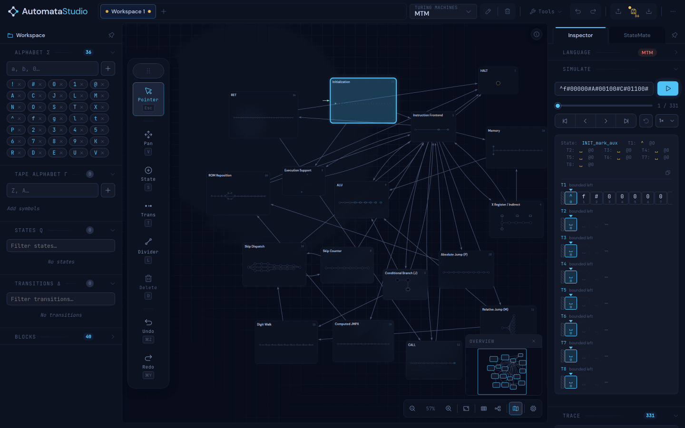
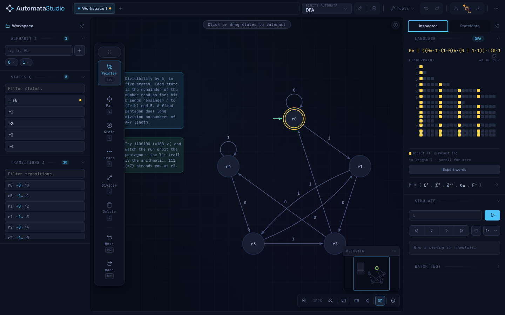
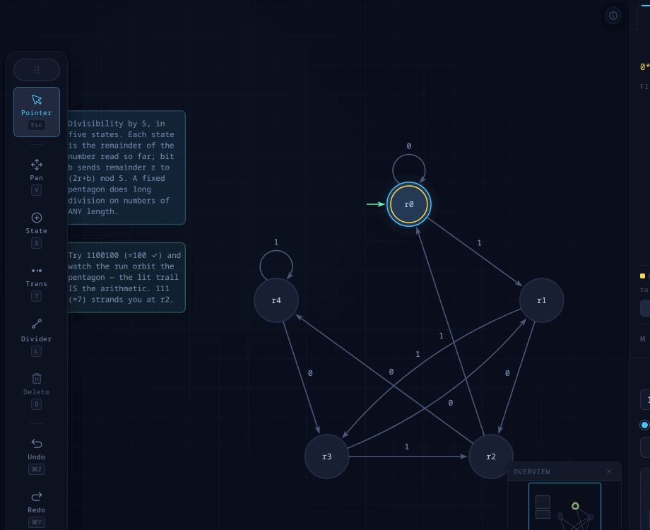
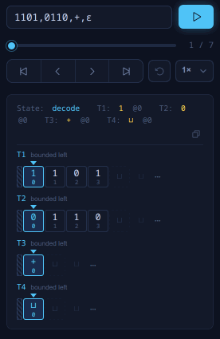
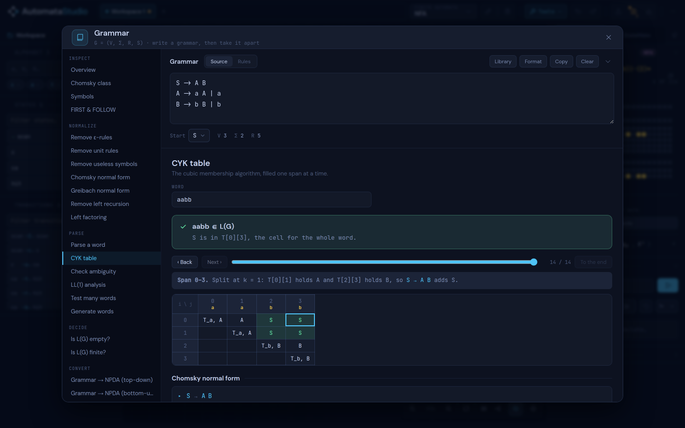
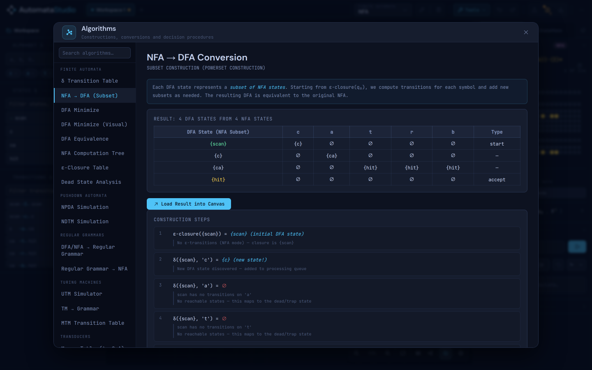
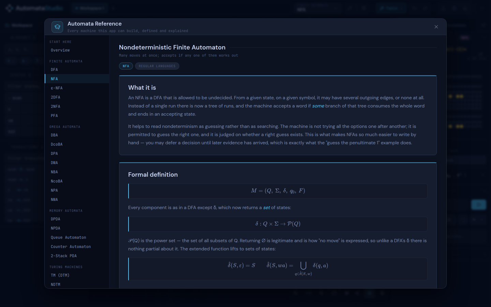

# AutomataStudio

An IDE for designing, testing and debugging automata. It includes an interactive grammar
workbench, visual algorithm stepping, a built-in theory reference, and StateMate, an AI assistant that can build and edit machines from a prompt. It is also Turing Complete!



<sup>A 5-bit accumulator CPU with a custom 19-opcode ISA, built entirely as an 8-tape
Turing machine — 614 states and 19,191 transitions, organised into 40 nested building
blocks, the 17 outermost of which are the boxes above: Instruction Frontend, ALU,
Memory, X Register, CALL, RET, the jumps. It runs
`ADD 4 / CMP 12 / BCS / JMP` — multiplication by repeated addition — fetching,
decoding and executing from the program on tape 1 until it halts with 12 in the
accumulator, in 331 machine steps.</sup>



<sup>The build view. A five-state DFA that reads a binary number most-significant bit
first and accepts the multiples of 5 — each state is the remainder so far, so bit `b`
sends remainder `r` to `(2r + b) mod 5`. The inspector on the right derives the
language rather than being told it: a regular expression by state elimination, the
formal tuple `M = (Q⁵, Σ², δ¹⁰, q₀, F¹)`, and an acceptance fingerprint — 187 words
decided so far, 41 accepted and 146 rejected, the ribbon deciding more as it is
scrolled. The panels on the left list Q and δ as editable rows; the notes on the
canvas are part of the saved document.</sup>

---

## Quick Start
Run the app locally. Requires Node.js.

```bash
git clone https://github.com/thethinkmachine/AutomataStudio.git
cd AutomataStudio
npm install
npm run dev
```

Open `http://localhost:5173/` (or whichever port Vite uses) in your browser.

```bash
npm test               # the test suite
npm run build          # production build -> dist/
npm run electron:dev   # run inside the desktop shell
```

## Features

### Machines
29 machine types, grouped as the model picker groups them:

| Group | Machines |
| --- | --- |
| Finite Automata | DFA, NFA, ε-NFA, 2DFA, 2NFA, PFA |
| Omega Automata | DBA, DcoBA, DPA, DWA, NBA, NcoBA, NPA, NWA |
| Memory Automata | DPDA, NPDA, Queue Automaton, Counter Automaton, 2-Stack PDA |
| Turing Machines | TM, NDTM, MTM, LBA, 2-Way Infinite TM |
| Transducers | Moore, Mealy, FST, Pushdown Transducer, 2-Way Transducer |

The eight ω-automata are determinism crossed with the acceptance condition
(Büchi, co-Büchi, parity, weak), so the label on screen is always the machine you
have. Multi-tape Turing machines take any tape count — the ceiling is a setting,
not a constant. Turing machines can be run on a one-way or two-way infinite tape.

### Building the machine
* **Interactive Canvas:** Draw states and transitions directly. Drag to reposition,
  bend edges by hand, and arrange automatically. Notes, regions and separators are
  first-class objects you can select and move like anything else.
* **Machine Wizard:** Build or edit a machine by answering questions — the alphabet,
  the states, the transitions — instead of drawing one. Covers every machine type.
* **Building Blocks:** A block is a sub-machine drawn as one node, with one entry and
  named exits. Blocks nest, can be reused from a library, and are inlined at
  placement time, so the machine stays flat and every simulator, exporter and
  decider works on it unchanged. See [docs/building-blocks.md](docs/building-blocks.md).
* **Multiple Workspaces:** Tabbed editing, each tab an independent document.
* **Themes:** 19 built-in themes, light and dark.

### Running it
* **Step-by-Step Simulation:** Watch tape execution and state transitions in real
  time, with a scrubber, a trace log, and a tape tracker that draws each model's
  ends honestly — a wall where the tape stops, a fade where it does not.
* **Batch Testing:** Decide a list of words at once, spread across every core.
* **Language Panel:** Derived regular expressions, language class, and a scrollable
  acceptance fingerprint.



<sup>The same DFA running `1100100` — 100 in binary, so it should accept. Stepping is a
scrubber over the whole run, not a play button: the trail lights the path the
computation actually took, the input row marks the symbol under the head, and the
trace log spells out each transition as a sentence. The counter reads `n / 8` because
a DFA's run is exactly one step per symbol plus the start.</sup>



<sup>A four-tape ALU computing 11 + 6 = 17: tapes 1 and 2 hold the operands `1101`
and `0110` — least-significant bit first, so 11 and 6 — tape 3 the opcode `+`, and
tape 4 the result `10001`. Every row is drawn as the model actually defines it — the
hatched cap and the `bounded left` label say this machine's tape stops at cell 0
rather than running on, which is a fact a plain row of cells cannot show. The rows
turn green when the run reaches its accepting state.</sup>

### Grammars
A grammar workbench with 25 tools in six groups — inspect, normalize, parse,
decide, convert, and a library to start from. Among them: FIRST/FOLLOW, Chomsky
classification, ε-removal, unit and useless-rule elimination, CNF, GNF, left
recursion removal, left factoring, CYK, parse trees, leftmost and rightmost
derivations, ambiguity witnesses, LL(1) tables, word generation, and conversion
to and from the canvas.



<sup>The grammar workbench. The grammar is written once in the sticky card at the top and
then taken apart by the tools in the rail; here CYK has decided `aabb ∈ L(G)` and the
table is scrubbed to its last step, with `S` in `T[0][3]` — the cell spanning the
whole word — and the line underneath naming the split that put it there. CYK is
defined on Chomsky normal form, so the conversion it ran on is shown below the table
rather than assumed.</sup>

### Getting it out
* **Import:** JFLAP `.jff` files, including the 6.1 variable and block notation.
* **Diagrams:** PNG and SVG, with text converted to outlines so a diagram carries
  its own type and does not depend on the reader having the fonts.
* **Interchange:** Graphviz DOT, TikZ/LaTeX, transition tables as CSV or Markdown,
  language samples, transition coverage, batch results, workspace JSON.
* **Code:** JavaScript, Python, Java, C, XState and SCXML, in table, switch or class
  styles — plus Jest and pytest suites.
* **Share links:** The whole workspace compressed into a URL. Nothing reaches a
  server.

### Saving
A workspace is a `.automaton` file. `.json` is accepted on import forever. PNG
export can additionally embed the workspace in the image: drop that image back onto
the canvas to resume editing.

### StateMate
An optional AI assistant that builds and edits machines from a prompt, or answers
questions about the one on screen. It runs against Anthropic, OpenAI, Mistral AI,
Google AI Studio, Cohere, OpenRouter, or any OpenAI-compatible local server; you
supply your own key, which is kept out of every save format. Write authority is
yours to set — ask, propose, or auto — and every candidate is executed against the
real simulator before it is offered. The canvas is written exactly once, at the end,
or not at all.

## Algorithms & Theory

34 interactive constructions from the standard textbooks (Hopcroft–Ullman, Sipser),
each one steppable:

* **Conversions:** NFA → DFA subset construction, ε-NFA → NFA, regex → NFA, NFA →
  regex, DFA ↔ regular grammar, TM → grammar, Moore ↔ Mealy.
* **Analysis:** DFA minimization (table-filling and visual), equivalence with a
  distinguishing string, ε-closure, dead states, computation trees.
* **Closure constructions:** union, intersection, concatenation, star, complement,
  reversal, product.
* **Decision procedures:** emptiness, finiteness, universality.
* **Tables:** transition, Moore, Mealy, multi-tape.
* **A universal Turing machine** visualizer.



<sup>Subset construction on an NFA that searches for the keywords *cat*, *car* and *cab*.
Each DFA state is a set of NFA states, and the algorithm is shown as a table plus the
numbered steps that built it — including the reads that go nowhere and collapse to the
dead state. `Load Result into Canvas` puts the constructed DFA on the canvas as an
ordinary machine you can then edit, run or export.</sup>

A built-in reference explains every machine in the picker and carries a Decidability
section — decidable vs. recognizable, the decidable questions for finite automata
and CFLs, diagonalization, reductions, Rice's theorem, and a map of what is decidable
where.



<sup>The built-in reference. One page per machine the app can build, each with what the
model is, its formal definition, and what it can and cannot recognise; the rail lists
them in the same groups the model picker uses. The pages are generated from the same
registry the picker reads, and a test fails if a machine the picker offers has no
guide — so a machine added to the app cannot quietly go undocumented.</sup>

## Desktop app
The Windows and Linux AppImage builds update themselves: they check on startup and
on demand from **⋯ → Check for Updates**. If a check fails it shows a code —
[what the update error codes mean](docs/update-error-codes.md). macOS builds are not
self-updating.

## Known Issues / Roadmap
- Regular expression derivation is refused past 120 states: state
  elimination is cubic in |Q|, so the Language panel asserts the class rather than
  deriving an expression on large machines.
- An exported SVG inlines the whole application stylesheet, which dominates the file
  size. Narrowing that scrape to the canvas rules is the largest size win available.
- Pushdown automata accept by final state only. A JFLAP file that accepts by
  empty stack is imported as final-state acceptance and flagged, since it may
  decide a different language.

## Contributing
Pull requests are welcome. Commits must be signed off (`git commit -s`) — see
[CONTRIBUTING.md](CONTRIBUTING.md), which explains the one legal formality and why
the project's licensing commitments depend on it.

## License
**[PolyForm Noncommercial License 1.0.0](LICENSE)**, with a supplemental grant that
converts each release to **AGPL-3.0-or-later** four years after it is published.

Releases published before the license change remain available under CC BY-NC-SA 4.0
([LICENSE-PRIOR-VERSIONS.txt](LICENSE-PRIOR-VERSIONS.txt)); that grant is irrevocable
and is not withdrawn by the change.