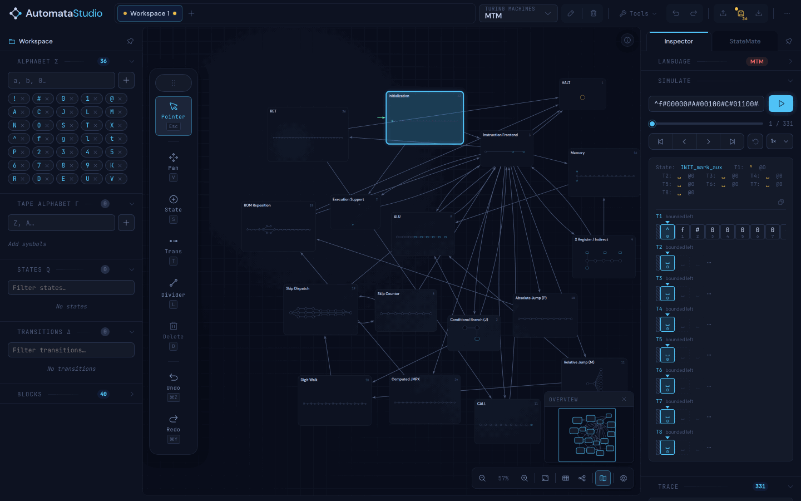
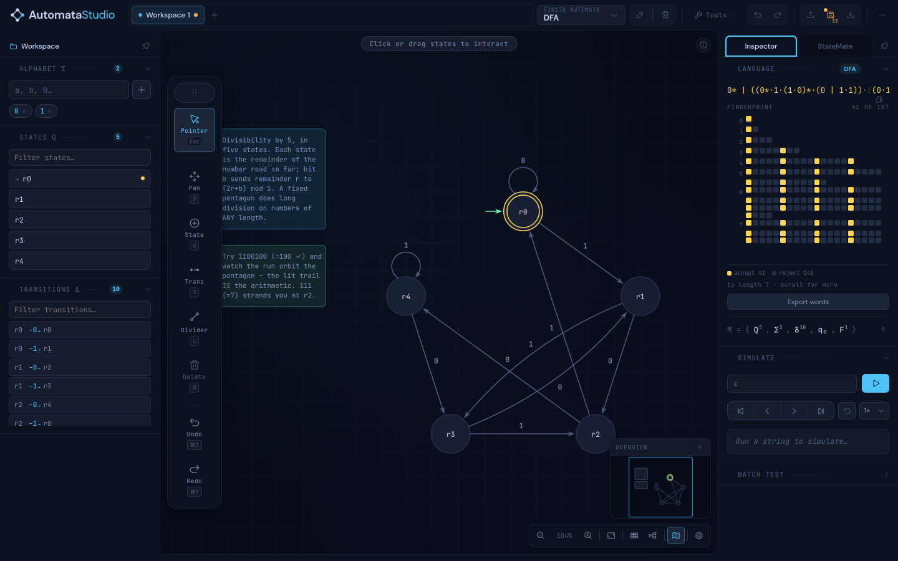
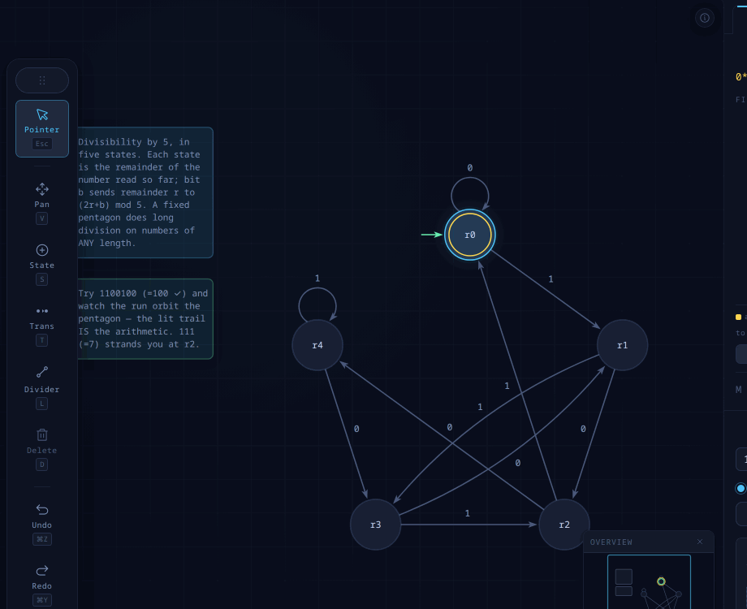
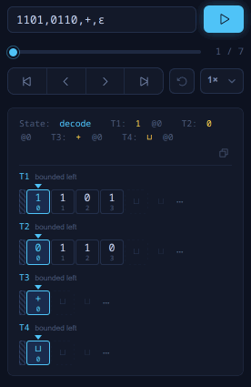
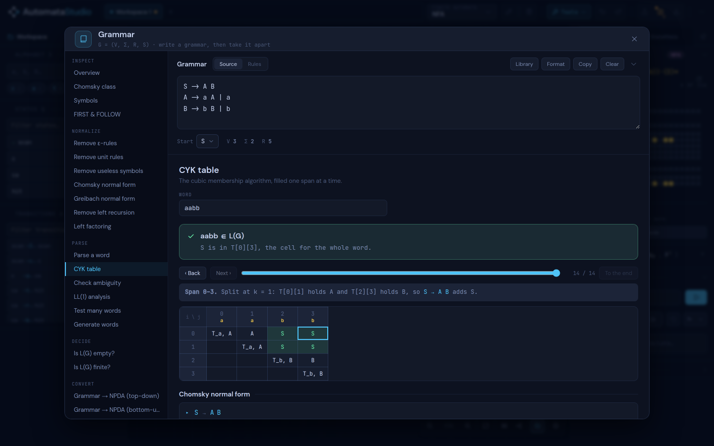
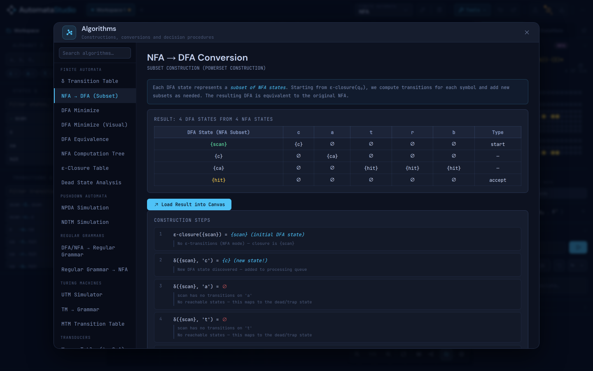
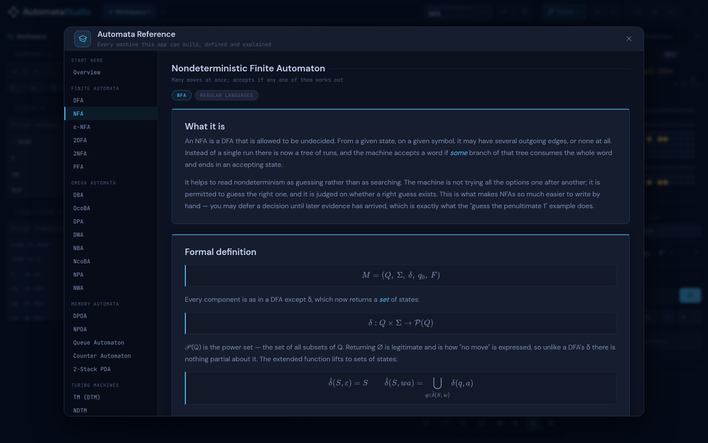

<div align="center">

# AutomataStudio

**An IDE for designing, simulating and analysing automata.**

Draw a machine, run it step by step, derive its language, put it through the textbook
constructions, and take it out as a diagram, LaTeX or working code. It covers 30
machine types, from DFAs to multi-tape Turing machines and ω-automata.

[](https://github.com/thethinkmachine/AutomataStudio/releases)
[](LICENSE)
[](https://github.com/thethinkmachine/AutomataStudio/actions/workflows/deploy.yml)
[](https://github.com/thethinkmachine/AutomataStudio/actions/workflows/electron-build.yml)

[**Open in the browser**](https://thethinkmachine.github.io/AutomataStudio/) ·
[Download the desktop app](https://github.com/thethinkmachine/AutomataStudio/releases/latest) ·
[Machine library](https://thethinkmachine.github.io/automata-library/) ·
[Cite](#citation)



<sup>A 5-bit accumulator CPU with a 19-opcode instruction set, built entirely as an 8-tape
Turing machine: 614 states and 19,191 transitions in 40 nested building blocks. It
runs a multiply-by-repeated-addition program from tape 1 and halts with 12 in the
accumulator after 331 steps.</sup>

</div>

---

## Contents

- [Getting started](#getting-started)
- [Features](#features)
- [Algorithms and theory](#algorithms-and-theory)
- [Command line](#command-line)
- [Development](#development)
- [Known issues](#known-issues)
- [Contributing](#contributing)
- [Citation](#citation)
- [License](#license)

## Getting started

You can use AutomataStudio in three ways.

| | How | Notes |
| --- | --- | --- |
| **Web** | [thethinkmachine.github.io/AutomataStudio](https://thethinkmachine.github.io/AutomataStudio/) | Nothing to install, and your machines stay in your browser. |
| **Desktop** | [Latest release](https://github.com/thethinkmachine/AutomataStudio/releases/latest) for Windows, macOS and Linux | Windows and Linux AppImage builds update themselves. The `automata` CLI ships inside. |
| **From source** | See below | Requires Node.js 20.19+ or 22.12+ (24 LTS recommended). |

```bash
git clone https://github.com/thethinkmachine/AutomataStudio.git
cd AutomataStudio
npm install
npm run dev            # http://localhost:5173
```

### Your first machine

1. Choose a model from the picker, for example **DFA**.
2. Use the **State** tool to place states and the **Transition** tool to connect
   them, then double-click a state to mark it accepting.
3. Type a word into the run box and step through it, or paste a list of words into
   the batch tester.
4. The inspector on the right derives the language for you: a regular expression, the
   formal tuple, and an acceptance fingerprint.

You can also skip drawing. The **Machine Wizard** builds a machine from your answers
to a few questions, **StateMate** builds one from a prompt, and the
[machine library](https://thethinkmachine.github.io/automata-library/) has ready-made
machines to open and remix.



<sup>A five-state DFA that accepts binary multiples of 5. The inspector derives a regular
expression by state elimination, the tuple `M = (Q⁵, Σ², δ¹⁰, q₀, F¹)`, and an
acceptance fingerprint of the words decided so far.</sup>

## Features

### Machines

| Group | Machines |
| --- | --- |
| Finite automata | DFA, NFA, ε-NFA, 2DFA, 2NFA, PFA |
| ω-automata | DBA, DcoBA, DPA, DWA, NBA, NcoBA, NPA, NWA |
| Memory automata | DPDA, NPDA, Queue Automaton, Counter Automaton, 2-Stack PDA, Embedded PDA |
| Turing machines | TM, NDTM, Multi-tape TM, LBA, Two-way infinite TM |
| Transducers | Moore, Mealy, FST, Pushdown Transducer, Two-way Transducer |

The ω-automata are deterministic and nondeterministic variants of four acceptance
conditions (Büchi, co-Büchi, parity and weak), and their input is an ultimately periodic
word `u(v)`. A multi-tape Turing machine can have any number of tapes.

### Building
- **Canvas.** Draw states and transitions, bend edges, and arrange the diagram
  automatically. Notes, regions and separators are part of the saved document.
- **Building blocks.** A block is a sub-machine shown as one node, with one entry and
  named exits. Blocks nest and can be reused, and they are inlined when placed, so
  every simulator and exporter sees an ordinary machine.
  See [docs/building-blocks.md](docs/building-blocks.md).
- **Machine Wizard.** Builds or edits any machine type from a series of questions.
- **Workspaces and themes.** Edit in multiple tabs, choose from 19 light and dark themes, and use the
  mobile layout on small screens.

### Running
- **Step-by-step simulation** with a scrubber, a trace log in plain sentences, and a
  tape view that shows each model's tape boundaries.
- **Batch testing** runs a word list across every CPU core.
- **Nondeterminism** is shown as a computation tree. Turing machines can be proved to
  halt, or proved never to halt, beyond what a step budget can tell you.
- **Language panel** shows the derived regular expression, the language class and an
  acceptance fingerprint.





<sup>Left: the divisibility DFA accepting `1100100` (100 in binary). Right: a four-tape ALU
computing 11 + 6 = 17, with each tape drawn as its model defines it.</sup>

### Grammars
The grammar workbench has 25 tools for inspecting, normalising, parsing, deciding and
converting grammars. They include FIRST/FOLLOW, Chomsky classification, CNF and GNF,
removal of ε, unit, useless and left-recursive rules, left factoring, CYK, parse trees,
derivations, ambiguity witnesses, LL(1) tables, and conversion to and from the canvas.



### Import, export and sharing
- **Import:** JFLAP `.jff` (including 6.1 blocks), XState, SCXML, and machine codes.
- **Diagrams:** PNG and SVG, with text converted to outlines. A PNG can embed the
  workspace, so dropping it back on the canvas resumes editing.
- **Interchange:** Graphviz DOT, TikZ/LaTeX, CSV and Markdown transition tables, and
  workspace JSON.
- **Code generation:** JavaScript, Python, Java, C, XState and SCXML, with Jest and
  pytest suites.
- **Share links:** the whole workspace is compressed into a URL and never sent to a
  server.
- **Exercises:** sealed reference solutions with exact or bounded grading, for teaching.

### StateMate (optional AI assistant)
StateMate builds and edits machines from a prompt and answers questions about the one
on screen. It works with Anthropic, OpenAI, Mistral AI, Google AI Studio, Cohere,
OpenRouter, or any OpenAI-compatible local server. You supply your own key, and it is
never written to a saved file. Every candidate machine is run on the real simulator
before you see it, and you choose whether StateMate asks, proposes or applies changes
automatically.

## Algorithms and theory

The app has 34 interactive constructions from the standard textbooks (Hopcroft &
Ullman, Sipser), and each one can be stepped through:

- **Conversions:** subset construction, ε-NFA → NFA, regex ↔ NFA, DFA ↔ regular
  grammar, TM → grammar, Moore ↔ Mealy
- **Analysis:** minimisation (table-filling and visual), equivalence with a
  distinguishing word, ε-closure, dead states, computation trees
- **Closure:** union, intersection, concatenation, star, complement, reversal, product
- **Decision procedures:** emptiness, finiteness, universality
- **A universal Turing machine** visualiser



A built-in **reference** has a page for every machine type, covering its formal
definition and what it can and cannot recognise. It also has sections on decidability
(Rice's theorem, reductions, diagonalisation) and on language classes.



## Command line

`automata` runs the same engine from a terminal. You can use it to run, test, trace and
animate machines, compare and convert them, grade a class, learn a DFA from examples,
serve machines over MCP, and prove whether Turing machines halt.

```sh
automata run machine.automaton 0110 101          # ✔ accept / ✘ reject / ? unknown
automata play machine.automaton 0110 --history   # animated run in the terminal
automata from-regex "(a|b)*abb" | automata minimize - | automata codegen - --lang py
automata grade exercise.automaton submissions/ --csv grades.csv
automata halts machines.txt --proof proofs/      # halting proofs, checkable with check-proof
```

It also reads and writes HOA, BA, Timbuk and JFLAP. To install it, add the desktop
app's `resources/cli` directory to your `PATH`, or run `npm install && npm link` from a
checkout. Read the [CLI guide](docs/cli.md) for task-by-task instructions, or the
[command reference](docs/cli-reference.md) for every option.

## Development

```bash
npm run dev               # Vite dev server
npm test                  # node:test suite (tests/*.test.js)
npm run build             # production web build -> dist/
npm run electron:dev      # the desktop shell against the dev server
npm run electron:build    # installers -> release/
npm run cli -- --help     # the CLI, from source
npm run bench             # engine and renderer timings vs. bench/baseline.json
```

The code is organised as follows:

```
js/            the app: plain ES modules, SVG rendering, Solid signals for derived panels
js/machines/   one module per machine family, behind a registry (DOM-free)
js/grammar/    the grammar workbench
cli/           the `automata` command line
electron/      the desktop shell
wasm/          the label-placement kernel (AssemblyScript)
tests/         node:test, with a DOM stub
docs/          user documentation and media
```

[CLAUDE.md](CLAUDE.md) holds the architecture notes: the module layout, the change
notification store, the renderer, and how to add a machine type (one row in
`MachineTypes` and one `defineMachine` call).

## Known issues

- Regular-expression derivation stops at 120 states. State elimination is cubic, so
  larger machines show the language class instead of an expression.
- An exported SVG inlines the whole application stylesheet, which makes the file larger
  than it needs to be.
- Pushdown automata accept by final state only. A JFLAP file that accepts by empty
  stack is imported as final-state acceptance and flagged.

Bug reports and feature requests go to the
[issue tracker](https://github.com/thethinkmachine/AutomataStudio/issues). If the
desktop updater reports an error, the code is explained in
[docs/update-error-codes.md](docs/update-error-codes.md).

## Contributing

Pull requests are welcome. Commits must be signed off (`git commit -s`).
[CONTRIBUTING.md](CONTRIBUTING.md) explains why the licence requires it. To contribute
machines, submit them to the
[machine library](https://github.com/thethinkmachine/automata-library), either from
the app's Library view or through the library's issue form.

## Citation

If you use AutomataStudio in your research, teaching materials or a publication,
please cite it. GitHub's **"Cite this repository"** button (from
[CITATION.cff](CITATION.cff)) produces APA and BibTeX, or you can copy these:

```bibtex
@software{chaubey_automatastudio_2026,
  author  = {Chaubey, Shreyan},
  title   = {{AutomataStudio}: An {IDE} for Designing, Simulating and Analysing Automata},
  year    = {2026},
  version = {2.9.0},
  url     = {https://github.com/thethinkmachine/AutomataStudio},
  note    = {Software}
}
```

> Chaubey, S. (2026). *AutomataStudio: An IDE for designing, simulating and analysing
> automata* (Version 2.9.0) [Computer software].
> https://github.com/thethinkmachine/AutomataStudio

Cite the version you actually used, so that others can reproduce your results. If you
have a paper, course or project that uses AutomataStudio, please open an issue to let
me know.

## License

AutomataStudio is released under the
**[PolyForm Noncommercial License 1.0.0](LICENSE)**. Under a supplemental grant, each
release converts to **AGPL-3.0-or-later** four years after it is published. Academic
research, teaching and personal use are noncommercial uses under the licence. See
[NOTICE](NOTICE) for the required notice.

Releases published before the licence change remain available under CC BY-NC-SA 4.0
([LICENSE-PRIOR-VERSIONS.txt](LICENSE-PRIOR-VERSIONS.txt)). That grant is irrevocable.

© 2026 Shreyan Chaubey
