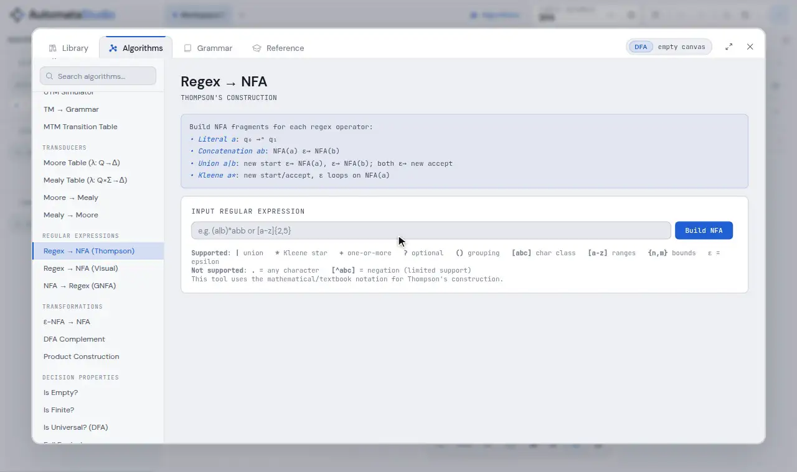
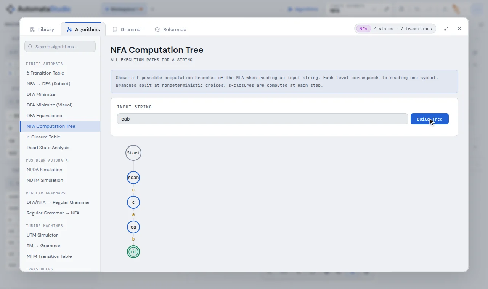
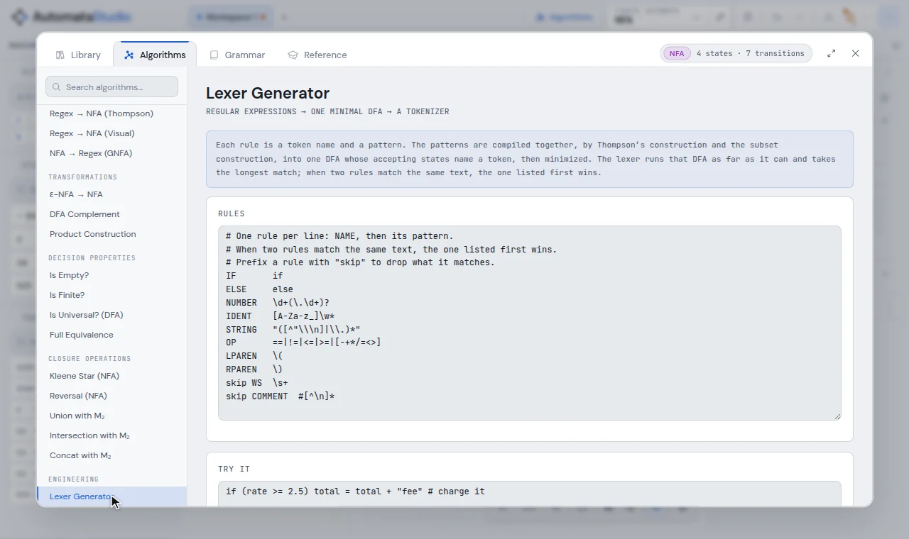

# Algorithms

The Algorithms view holds the textbook constructions of automata theory as
interactive pages. Each one works on the machine on your canvas, shows its working
step by step, and can put its result back on the canvas as an ordinary machine you can
edit, run or export.

Open it with the **Algorithms** tab of the aux window, or <kbd>3</kbd> on the canvas.
The chip at the top right names the machine it is reading. The search box at the top of
the list filters it.



<sup>`(a|b)*abb` through the whole pipeline. Thompson's construction gives a 14-state
ε-NFA, the subset construction a 5-state DFA, and table-filling minimisation the 4-state
DFA from the textbook. Each result is loaded onto the canvas before the next step reads
it.</sup>

- [How a page works](#how-a-page-works)
- [The catalogue](#the-catalogue)
- [Two-machine operations](#two-machine-operations)
- [The lexer generator](#the-lexer-generator)
- [Grammars](#grammars)

---

## How a page works

Most pages compute from the machine on the canvas as soon as you open them. Some take an
input first: a regular expression, a word to trace, or a second machine.

- **Load Result into Canvas** replaces the canvas with the constructed machine. One
  <kbd>Ctrl</kbd>+<kbd>Z</kbd> brings back what was there.
- **Construction steps** list what the algorithm did, in order, with the reason for each
  step. The subset construction, for example, records each `δ(S, a)` it computed, and
  which ones found a new DFA state.
- **Visual** pages (*DFA Minimize (Visual)*, *Regex → NFA (Visual)*) step through the
  construction with **Back** and **Next**.

A page that does not apply to the machine on the canvas says so and why, for example
"Your automaton is already a DFA" on the subset construction.



## The catalogue

**Finite automata**

| Page | What it does |
| --- | --- |
| δ Transition Table | δ as a table: one row per state, one column per symbol |
| NFA → DFA (Subset) | the subset (powerset) construction, from ε-closure(q₀) |
| DFA Minimize | table-filling (Myhill–Nerode): distinguishable pairs, equivalence classes, the minimal DFA |
| DFA Minimize (Visual) | the same, stepped one marking round at a time |
| DFA Equivalence | whether two DFAs accept the same language |
| NFA Computation Tree | every branch an NFA takes on a word, level by level |
| ε-Closure Table | the ε-closure of every state of an ε-NFA |
| Dead State Analysis | which states are reachable, which can still reach acceptance, and which are dead |

**Pushdown automata and nondeterministic TMs**

| Page | What it does |
| --- | --- |
| NPDA Simulation | breadth-first search over an NPDA's branches, each with its stack |
| NDTM Simulation | breadth-first search over a nondeterministic TM's branches |

**Regular grammars**

| Page | What it does |
| --- | --- |
| DFA/NFA → Regular Grammar | a right-linear grammar: states become variables, transitions become rules |
| Regular Grammar → NFA | right- or left-linear grammar to an automaton |

**Turing machines**

| Page | What it does |
| --- | --- |
| UTM Simulator | a universal Turing machine: describe a TM in JSON and run it on a word |
| TM → Grammar | an unrestricted (type 0) grammar that generates the TM's language |
| MTM Transition Table | a multi-tape TM's δ: Q × Γᵏ → Q × Γᵏ × {L,R}ᵏ, one row per transition |

**Transducers**

| Page | What it does |
| --- | --- |
| Moore Table, Mealy Table | the transition table with outputs, λ: Q → Δ or λ: Q × Σ → Δ |
| Moore → Mealy | moves each output from a state onto the transitions entering it |
| Mealy → Moore | splits each state once per output that enters it |

**Regular expressions**

| Page | What it does |
| --- | --- |
| Regex → NFA (Thompson) | Thompson's construction: one NFA fragment per operator, joined by ε-moves |
| Regex → NFA (Visual) | the same, assembled one fragment per step |
| NFA → Regex (GNFA) | state elimination on a generalised NFA |

The regex syntax is `|` (union), concatenation, `*`, `+`, `?`, `()`, `[abc]`, `[a-z]`,
`{n,m}` and `ε`.

**Transformations**

| Page | What it does |
| --- | --- |
| ε-NFA → NFA | removes ε-moves by adding the transitions they stood for |
| DFA Complement | completes the DFA with a trap state, then swaps accepting and non-accepting |
| Product Construction | pairs of states simulating two DFAs at once, for ∩ and ∪ |

**Decision properties**

| Page | What it does |
| --- | --- |
| Is Empty? | whether any accepting state is reachable |
| Is Finite? | whether there is a cycle among useful states |
| Is Universal? (DFA) | whether L(M) = Σ\*, by checking the complement is empty |
| Full Equivalence | L(M₁) = L(M₂), by checking the symmetric difference is empty |

**Closure operations**

| Page | What it does |
| --- | --- |
| Kleene Star (NFA) | L\* |
| Reversal (NFA) | Lᴿ |
| Union with M₂ | L(M₁) ∪ L(M₂) |
| Intersection with M₂ | L(M₁) ∩ L(M₂), by the product construction |
| Concat with M₂ | L(M₁) · L(M₂) |

**Engineering**

| Page | What it does |
| --- | --- |
| Lexer Generator | token rules → one minimal DFA → a working tokenizer, with generated code |

## Two-machine operations

Equivalence, union, intersection and concatenation need a second machine, M₂. To set
one:

1. Draw (or open) the machine you want as M₂.
2. On the page, press **Save Current as M₂**.
3. Open or draw M₁ on the canvas, and run the page.

**Restore M₂ to Canvas** brings the saved M₂ back.

## The lexer generator

The **Lexer Generator** takes the constructions above to their practical end. Each rule
is a token name and a pattern:

```text
NUMBER   \d+(\.\d+)?
IDENT    [A-Za-z_]\w*
STRING   "([^"\\]|\\.)*"
skip WS  \s+
```

The patterns are compiled together, by Thompson's construction and the subset
construction, into one DFA whose accepting states name a token, and then minimised.
The tokenizer takes the longest match, and when two rules match the same text, the one
listed first wins. A rule prefixed with `skip` is matched and dropped.

- **Try it** tokenises text as you type.
- The two most common lexer bugs are caught as you write the rules. A rule that matches
  the empty string is refused, since it would produce empty tokens forever. A rule that
  can never win, because an earlier one always matches first, is named in a warning
  along with the rules that shadow it (an `IDENT` listed above the keywords, say).
- Anchors, lazy quantifiers, backreferences and lookaround are refused, each with the
  reason it has no meaning in a lexer.
- **Generated code** is the same tokenizer in JavaScript, Python or C. It is the same
  program the page runs, and the tests check that all three produce the same tokens.
- **Load DFA onto canvas** opens the DFA in a new tab, so the machine you were working
  on is left alone.



## Grammars

Constructions on context-free grammars (CNF, GNF, CYK, LL(1), grammar ↔ PDA) live in
the [grammar workbench](grammar.md).
