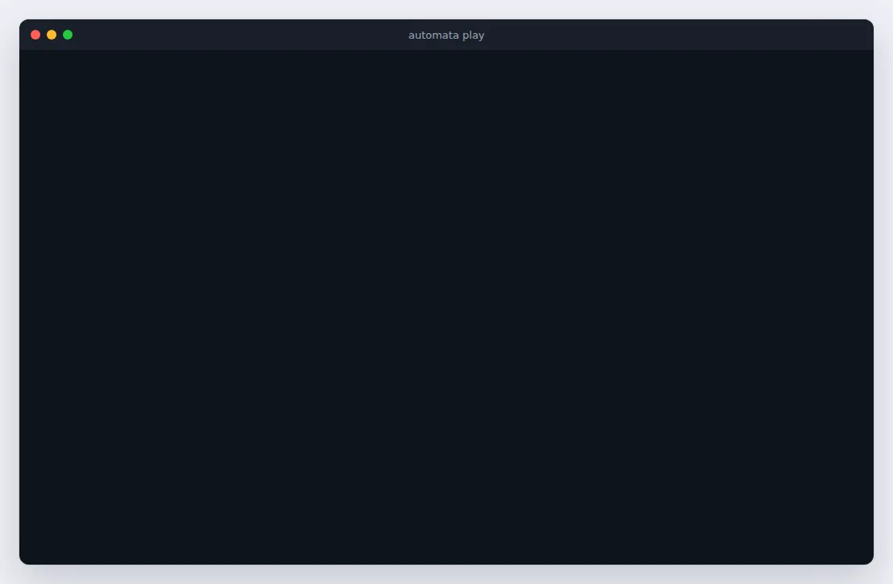
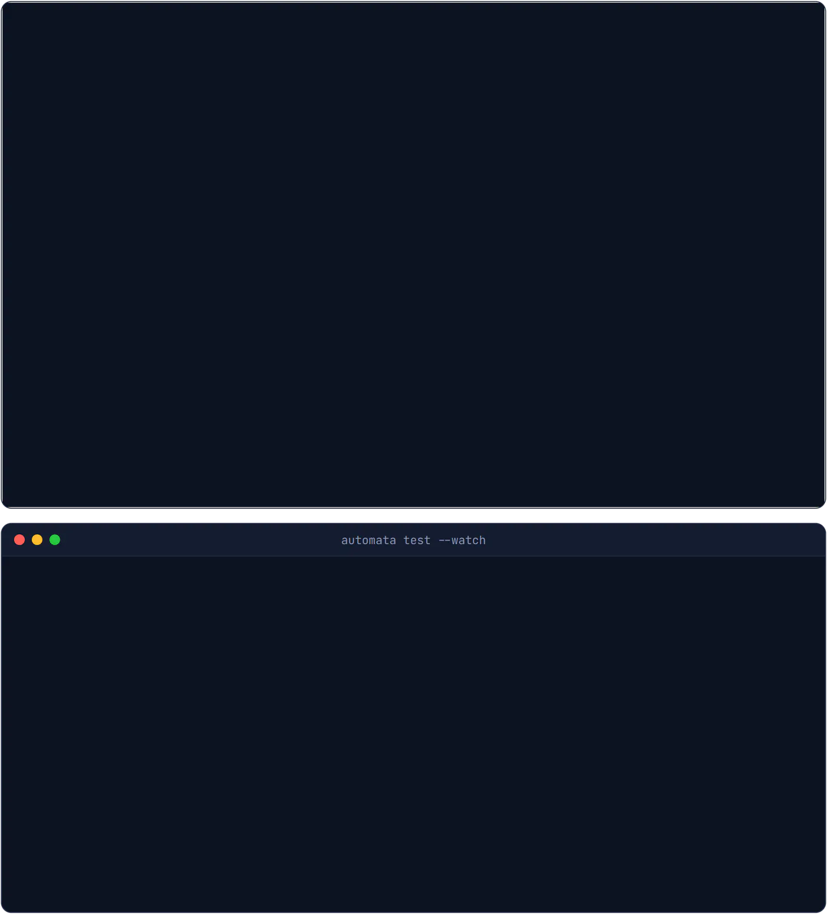
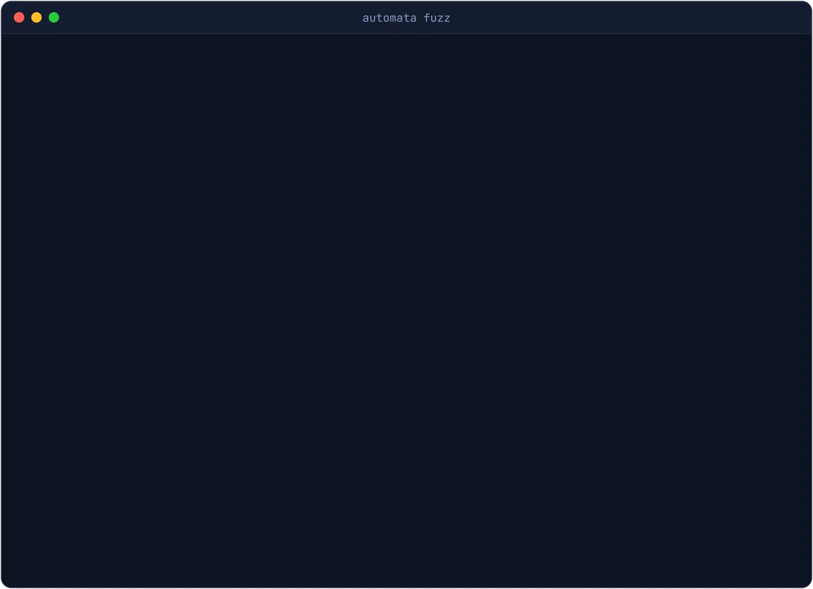
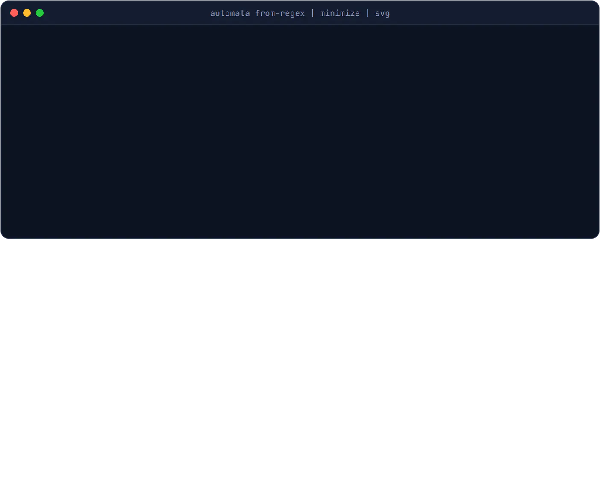
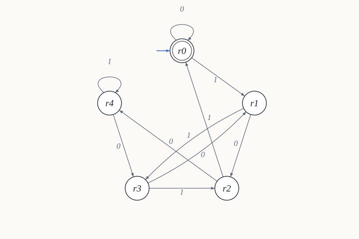
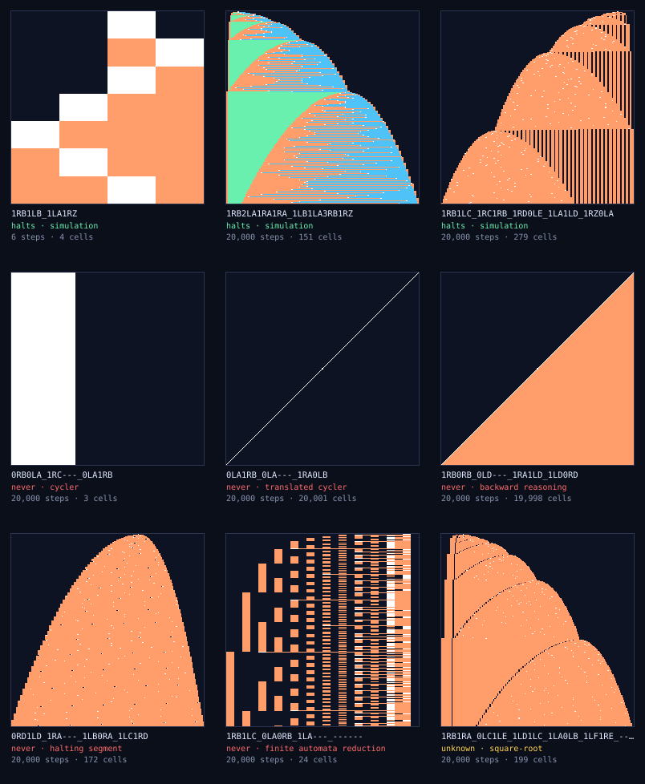
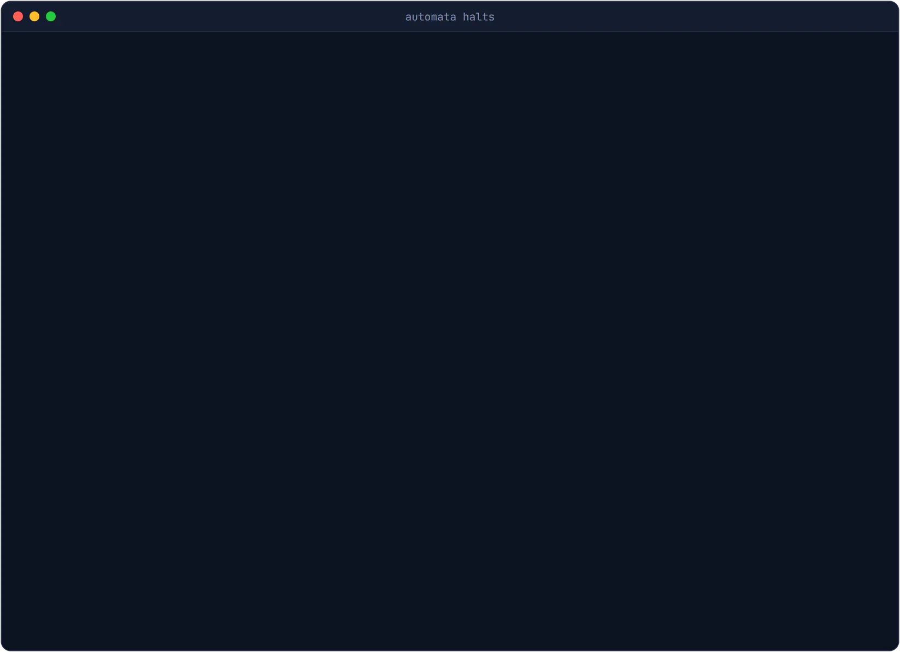
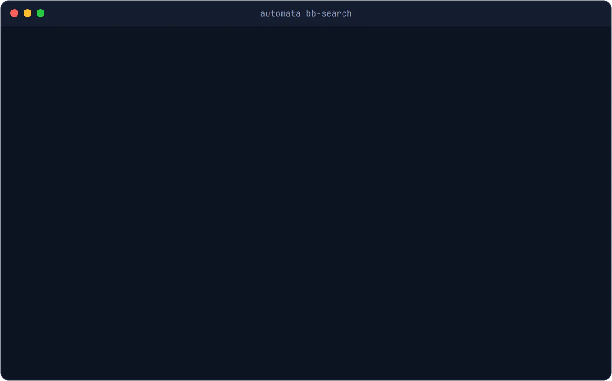
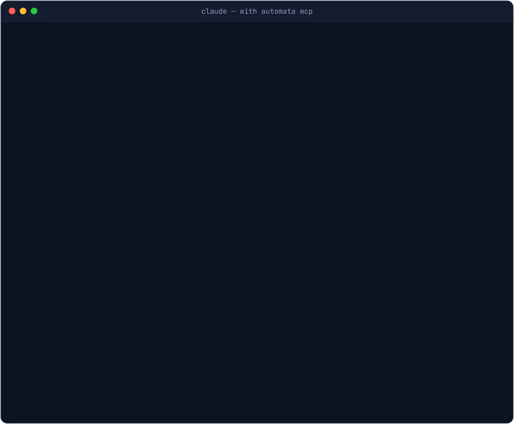

# The `automata` command line

`automata` is AutomataStudio's engine in a terminal: the same simulators, the same grader, the same exporters and the same Turing-machine analysis as the app, driven by commands instead of clicks. Use it to check machines in CI, grade a class at once, convert between tools, script experiments, or just watch a Turing machine run.

This guide walks through it by task. Every option of every command is in the [command reference](cli-reference.md), and `automata <command> --help` prints the same thing in the terminal.



<sup>`automata play add.automaton 0101+11 --history`: the binary-addition Turing machine adding 5 and 3. The states line lights the current state, the tape is drawn in colour with the head marked, and `--history` grows the space-time diagram a row per step. Each key is labelled as it is pressed: <kbd>space</kbd> pauses, <kbd>←</kbd> <kbd>→</kbd> step, <kbd>+</kbd> speeds up. It accepts after 43 steps with `1000` (8) on the tape.</sup>

| If you want to… | Read |
| --- | --- |
| get it running | [Install](#install), then [Five minutes with it](#five-minutes-with-it) |
| run, test, trace or watch a machine | [Machines and words](#machines-and-words), [Running machines](#running-machines) |
| inspect, lint or profile one | [Looking at a machine](#looking-at-a-machine) |
| compare two machines, or a machine against a script | [Comparing machines](#comparing-machines) |
| build machines from regexes and operations | [Building machines: pipes and expressions](#building-machines-pipes-and-expressions) |
| convert to and from JFLAP, HOA, BA, SCXML, code | [Formats](#formats-getting-machines-in-and-out) |
| make diagrams and animations | [Pictures and animations](#pictures-and-animations) |
| set and grade exercises, or use Gradescope | [Teaching: exercises and grading](#teaching-exercises-and-grading) |
| prove whether Turing machines halt | [Turing machines: does it halt?](#turing-machines-does-it-halt) |
| learn a DFA from examples | [Learning a machine](#learning-a-machine) |
| use it in scripts, CI, git or an AI agent | [Scripts, CI and git](#scripts-ci-and-git), [AI agents (MCP)](#ai-agents-mcp), [Exit codes](#exit-codes) |
| fix a problem | [Colour and the terminal](#colour-and-the-terminal), [Troubleshooting](#troubleshooting) |

## Follow along

Every example on this page runs as written from [`examples/cli/`](../examples/cli/) in a checkout of the repository, and the output shown under a command is what it prints there: the blocks are regenerated from the real commands, and a test fails when one goes stale.

```sh
cd examples/cli
```

| File | What it is |
| --- | --- |
| `div5.automaton` | a DFA for the binary numbers divisible by 5: five states, one per remainder |
| `words.txt` | expectations for it, one word a line |
| `contains-aab.automaton` | a draft DFA for the words containing `aab`, with the classic mistake in it |
| `contains-aab.mjs`, `contains-aab.py` | what that language is meant to be, as a program: the oracle `fuzz` and `learn` ask |
| `add.automaton` | a Turing machine that adds two binary numbers |
| `machines.txt` | nine Turing machines, one for each way `halts` can answer |
| `messy.automaton` | a DFA with things for `lint` to find |
| `class/` | an exercise and nine students' answers, for `grade` and `similar` |

---

## Install

**With the desktop app.** The CLI ships inside it and runs on the app's own executable, so nothing else is needed. The installers put `automata` on your `PATH`:

| Platform | How `automata` gets on your `PATH` |
| --- | --- |
| Windows | The installer adds `%LOCALAPPDATA%\Programs\AutomataStudio\resources\cli` to your user `PATH`, and the uninstaller removes it. Open a new terminal after installing. |
| macOS | In the app, choose **AutomataStudio → Install 'automata' Command in PATH**. It links `/usr/local/bin/automata`, asking for your password if that folder needs it. Move the app to Applications first. |
| Linux (.deb) | The package links `/usr/local/bin/automata`, and removing it takes the link away. An `automata` already there (from npm, say) is left alone. |
| Linux (AppImage) | Nothing to install: run `./AutomataStudio-*.AppImage --cli <command> …`. |

On macOS and Linux, `AutomataStudio --cli <command> …` works without the launcher too.

**From a checkout of the repository** (Node 20 or newer):

```sh
npm install
npm link            # puts `automata` on your PATH, running the source
automata --version
```

**As a single bundle**, for a machine with Node but without the repository:

```sh
npm run cli:build   # writes dist-cli/
node dist-cli/automata.mjs --help
```

`dist-cli/` is self-contained; copy the folder anywhere.

---

## Five minutes with it

What is this machine?

<!-- automata-output: info div5.automaton -->
```text
$ automata info div5.automaton
── Machine ─────────────────────────────────────────────────────────────────────
  type           DFA — Deterministic Finite Automaton
  size           5 states, 10 transitions
  Σ              {0, 1}
  start          r0
  accepting      r0
  deterministic  yes

── Language ────────────────────────────────────────────────────────────────────
  class        Regular
  language     infinite
  minimal DFA  5 states (5 with the sink)  ✔ this DFA is minimal
  regex        0* | ((0*·1·(1·0)*·(0 | 1·1))·((0·1*·0·1 | ((1·0*·1 | 0·1*·0·0)·(1·0)*)·(0 | 1·1))*))·1·0*

── Names ───────────────────────────────────────────────────────────────────────
  code  fa.01:+AB_CD_EA_BC_DE
```

Does it accept these words? The exit code is the verdict: 0 when every word was accepted, 1 when one was rejected.

<!-- automata-output: run div5.automaton 0 101 11 "" -->
```text
$ automata run div5.automaton 0 101 11 ""
0    ✔ accept
101  ✔ accept
11   ✘ reject
ε    ✔ accept
```

Does this Turing machine halt?

<!-- automata-output: halts 1RB1LB_1LA1RZ 0LA1RB_0LA---_1RA0LB -->
```text
$ automata halts 1RB1LB_1LA1RZ 0LA1RB_0LA---_1RA0LB
#  machine               verdict  method             why
1  1RB1LB_1LA1RZ         ■ halts  simulation         after 6 steps, 4 non-blank cells
2  0LA1RB_0LA---_1RA0LB  ∞ never  translated cycler  repeats 1 cell further left every step

1 halt, 1 never halt, 0 unknown
```

Three more to try, each shown in a clip further down: `automata play add.automaton 0101+11 --history` (above), a [pipeline from a regular expression to a drawing](#building-machines-pipes-and-expressions), and `automata halts 1RB1LC_1RC1RB_1RD0LE_1LA1LD_1RZ0LA`, the five-state busy beaver, which halts after 47,176,870 steps and `halts` finds that by running it, in a few seconds.

---

## Machines and words

### A machine can be a file, a pipe, or a line of text

| You give | What it is |
| --- | --- |
| `machine.automaton`, `machine.json` | the app's own document — what Save writes |
| `machine.jff` | JFLAP (finite automata, PDAs, Turing machines, Mealy, Moore) |
| `chart.scxml`, `machine.js` | a statechart (SCXML, or an XState config), flattened into a machine |
| `nba.hoa` | Hanoi Omega-Automata, as Spot, Owl and other LTL tools write |
| `nba.ba` | RABIT/GOAL Büchi automata |
| `-` | standard input — so machines can be piped between commands |
| `1RB1LB_1LA1RZ` | a Turing machine in the standard (bbchallenge) notation |
| `fa.01:+AB_BA` | a *machine code*: any machine as one line (the app's **Copy Machine Code** writes these) |

The standard Turing-machine notation lists one segment per state, `A`, `B`, `C`, …; within a segment, one triple per symbol read (0 first): the symbol written, `L` or `R`, and the next state. `Z` halts, and `---` is an undefined transition, which halts too.

### Typing words

- Single-character symbols run together: `0110`.
- Multi-character symbols are separated by spaces or commas: `"01 11 00"`.
- The empty word is `""`, `ε` or `eps`.
- An ω-automaton reads an infinite word written **u(v)**: a prefix `u`, then `v` forever. `"(ab)"` is ababab…, `"a(b)"` is abbbb….

A **words file** (for `test` and `learn`) has one word per line. `w => accept` or `w => reject` makes the line an expectation, and `#` starts a comment — [`words.txt`](../examples/cli/words.txt) begins:

```text
# Binary multiples of five, for div5.automaton.
0        => accept
101      => accept
1        => reject
```

---

## Running machines

```sh
automata run machine.automaton 0110 101 ""     # decide words
automata test machine.automaton words.txt      # check expectations
automata trace machine.automaton 0110          # every step, in a table
automata play machine.automaton 0110           # every step, animated
```

**`run`** prints each word's verdict: `✔ accept`, `✘ reject`, or `? unknown` when the step budget ran out first. That third answer matters: a Turing machine still running after 100,000 steps has not been shown to reject, and `run` says so (exit code 2) instead of guessing. Raise the budget with `--max-steps`. A transducer (Mealy, Moore, FST, PDT) prints its output: `01 11  ● done  → 10`.

**`test`** reads a words file and reports each expectation as passed (`✓`), failed (`✗`) or undecided (`?`):

<!-- automata-output: test div5.automaton words.txt -->
```text
$ automata test div5.automaton words.txt
✓  0        ✔ accept  expected accept
✓  101      ✔ accept  expected accept
✓  1010     ✔ accept  expected accept
✓  1111     ✔ accept  expected accept
✓  1100100  ✔ accept  expected accept
✓  1        ✘ reject  expected reject
✓  110      ✘ reject  expected reject
✓  111      ✘ reject  expected reject
✓  1011     ✘ reject  expected reject
✓  10011    ✘ reject  expected reject

10 passed, 0 failed
```

With `--watch` it reruns whenever the machine or the file is saved — draw in the app, save, and see the results change in the terminal:



<sup>`automata test --watch div5.automaton words.txt` beside the desktop app, open on the same file. The machine marks `r1` accepting as well as `r0`, so `1`, `110` and `1011` (remainder 1) are accepted when they should not be. Double-clicking `r1` unmarks it, <kbd>Ctrl</kbd>+<kbd>S</kbd> saves, and the terminal reruns by itself: 10 passed.</sup>

**`trace`** prints the run the app's player would show: the state (or set of states, for a nondeterministic machine), what the step did, and the machine's memory — the tape with its head marked, the stack or stacks, the unread input, the output. `--limit` caps the steps.

<!-- automata-output: trace div5.automaton 1010 -->
```text
$ automata trace div5.automaton 1010
0  {r0}  Start: r0               rest 1010
1  {r1}  Read '1' → r1           rest 010
2  {r2}  Read '0' → r2           rest 10
3  {r0}  Read '1' → r0           rest 0
4  {r0}  Read '0' → r0 — ACCEPT  rest ε

✔ accept
```

**`play`** animates the same run (the clip at the top of this page). In a terminal it takes over the screen:

| Key | Does |
| --- | --- |
| `space` | play / pause |
| `←` `→` | step back / forward |
| `+` `−` | faster / slower |
| `Home` `End` | first / last step |
| `h` | show or hide the space-time history |
| `r` | replay from the start |
| `q` `Esc` | quit — the last frame stays on the screen |

The screen shows every state with the current one lit, the tape in colour with its head marked by `▼` and its cells numbered, and, with `--history`, the space-time diagram growing a row per step. Each symbol keeps one colour throughout. Piped or redirected, `play` prints every frame in turn instead.

---

## Looking at a machine

```sh
automata info machine.automaton
automata lint machine.automaton
automata words machine.automaton --limit 20
automata profile tm.automaton --to 12
```

**`info`** answers "what is this?": the type, size and alphabets; the start and accepting states, or for other acceptance conditions (accepting by empty stack, parity, co-Büchi) what acceptance means; whether δ is deterministic. For a finite automaton it adds the language's class, whether it is empty, finite or universal, the minimal DFA's size (and whether this DFA already is minimal), and a regular expression. It ends with the machine's names: its standard notation, if it is a Turing machine, and its machine code. There is an example under [Five minutes with it](#five-minutes-with-it).

**`lint`** looks for mistakes: states the start cannot reach, states from which nothing can be accepted, symbols outside Σ, duplicate edges, a deterministic type whose δ branches, a weak automaton whose strongly connected components straddle F. Each finding names the rule that found it. It exits 1 on any error or warning — ready for CI.

<!-- automata-output: lint messy.automaton -->
```text
$ automata lint messy.automaton
  warning unreachable     Unreachable from the start: spare.
  warning not-in-sigma    Transitions read symbols that are not in Σ: 2.
  warning duplicate-edge  Transitions t1 and t9 are identical.
  error   branches        DFA branches at even on 1 — DFA already has δ(even, '1'). Each (state, symbol) pair must be unique.
```

A sink — a state that only loops to itself, the usual way to complete a DFA — is not reported, though nothing can be accepted from it.

**`words`** lists the accepted words, shortest first. For a finite automaton it works from the DFA, so it is exact and fast, and it can also **count** the accepted words of each length (`--count`, exactly, at any length) and draw **uniformly random** accepted words of a given length (`--sample 5 --len 40`). For other machines it runs every word up to `--max-len`.

<!-- automata-output: words div5.automaton --sample 4 --len 16 --seed 1 -->
```text
$ automata words div5.automaton --sample 4 --len 16 --seed 1
1001111010001110
0000110110100111
0101111011001001
0111011000101111
```

**`profile`** measures how expensive a machine is: steps and space (cells visited on a tape, the tallest the stack got) for every input up to a length, worst and average, as CSV, with an estimate of the growth — linear, quadratic, exponential. `--family "0^n 1^n"` profiles one structured input per length instead of all of them.

---

## Comparing machines

```sh
automata equiv mine.automaton reference.automaton
automata diff old.automaton new.automaton
automata similar submissions/
automata fuzz machine.automaton --oracle "python check.py {}" --mode stdout
```

**`equiv`** decides whether two machines accept the same language. For two finite automata it is exact and gives the shortest word they disagree on. For anything else it runs every word up to `--max-length` and says the check was bounded. Transducers are compared on their outputs. ω-automata are compared on every ultimately periodic word `u(v)` up to `--size` symbols.

**`diff`** is for versions of one machine: what changed (states, accepting states and transitions, matched by name, so moving a state on the canvas is not a change), whether the two are the same machine up to renaming states, and whether the language changed — with the shortest word that shows it. It is also git's view of a machine: see [Scripts, CI and git](#scripts-ci-and-git).

**`similar`** groups a folder of machines that are the same: finite automata by language (whatever they look like), anything else by structure. It is built for a folder of submissions — see [Teaching](#teaching-exercises-and-grading).

**`fuzz`** tests a machine against a program that says what the language is meant to be: every word up to length 3, then random ones, until the two disagree — and then it shrinks the disagreement to a minimal word. `-v` shows the word it found and each smaller word the shrinking kept.



<sup>`contains-aab.automaton` passes the obvious words; `fuzz` checks it against [`contains-aab.mjs`](../examples/cli/contains-aab.mjs), a four-line program, finds a 12-symbol word they disagree on, and shrinks it to `aaab`. `trace` then shows the bug itself: after `aa`, another `a` sends the machine back to the start instead of keeping the overlap.</sup>

The program gets the word as `{}` in the command (or appended), on stdin, and in `$AUTOMATA_WORD`. It answers with its exit code (`--mode exit`), a yes/no line (`--mode stdout`), or, for transducers, the expected output (`--mode output`). With `--batch`, one process answers every word, a line each — much faster, and what the clip uses. Either way the fixture oracle works, in Node or in Python:

```sh
automata fuzz contains-aab.automaton --oracle "python contains-aab.py {}" --mode stdout
automata fuzz contains-aab.automaton --oracle "node contains-aab.mjs" --batch --mode stdout
```

`{}` becomes a quoted reference to that variable rather than the word pasted in, so a word holding `$`, `\`, `&` or a backquote reaches the program as itself and is never run by the shell; every `{}` is replaced, so a script with braces of its own should read the variable instead. Under Windows' `cmd.exe`, a word containing `"` cannot be passed as an argument at all, and the CLI says so rather than guessing — read it from stdin.

---

## Building machines: pipes and expressions

Every command that makes a machine writes an `.automaton` document to standard output (or to `-o file`), and every command that reads one accepts `-`. So they chain:



<sup>`from-regex | minimize | svg`: the minimal DFA for `(a|b)*abb`, drawn. Then `eval` decides `(a|b)*abb ⊆ (a|b)*b` (true) and `(a|b)*abb = (a|b)*bb` (false — `bb` is the shortest word they disagree on).</sup>

```sh
automata from-regex "(a|b)*abb" \
  | automata determinize - \
  | automata minimize - \
  | automata codegen - --lang py -o abb.py
```

The operations: `from-regex`, `to-regex`, `determinize`, `minimize`, `complement`, `reverse`, `star`, `eps-elim` (one machine), and `union`, `concat`, `intersect`, `difference` (two).

**`eval`** puts them in one expression, and answers language questions with a counterexample:

<!-- automata-output: eval "/(a|b)*aab(a|b)*/ == A" A=contains-aab.automaton -->
```text
$ automata eval "/(a|b)*aab(a|b)*/ == A" A=contains-aab.automaton
false
counterexample: aaab
```

```sh
automata eval "min(det(A) & ~B)" A=a.automaton B=b.jff -o result.automaton
automata eval "A <= B" A=a.automaton B=b.automaton      # inclusion, with a counterexample
```

Operators, tightest first: `*` (star), `~` (complement), `.` (concatenation), `&` (intersection), `\` (difference), `|` or `+` (union). Functions: `min`, `det`, `comp`, `rev`, `star`, `eps`, `union`, `inter`, `diff`, `xor`, `concat`, `regex('…')`. A `/regex/` or a quoted path is a machine too.

`from-regex` reads the app's regex syntax — `|`, concatenation, `*` `+` `?`, `{n,m}`, `[a-z]`, `[^…]`, `.`, `ε` — and also what `to-regex` writes, so the two round-trip. `to-regex` warns when an alphabet symbol is also a regex operator (`+`, `.`), since such an expression reads fine but does not read back.

---

## Formats: getting machines in and out

```sh
automata convert machine.jff -o machine.automaton
automata convert nba.automaton --to hoa > nba.hoa
automata export machine.automaton -f tikz --opt standalone=true -o machine.tex
automata codegen dfa.automaton --lang c --style switch -o dfa.c
```

**`convert`** reads any format and writes any other; `--to` names the format, or the output file's extension implies it. `--minimize`, `--determinize` and `--eps-elim` transform on the way.

| Format | Reads | Writes | Notes |
| --- | :-: | :-: | --- |
| `automaton` / `json` | ✔ | ✔ | everything: layout, card, blocks, exercises |
| `jff` (JFLAP) | ✔ | ✔ | acceptance by empty stack is chosen in JFLAP, not the file — the writer warns |
| `hoa` | ✔ | ✔ | ω-automata; transition-based and generalized Büchi acceptance are moved onto states |
| `ba` | ✔ | ✔ | Büchi automata; RABIT and GOAL read a finite automaton written as BA as Büchi too — the writer warns |
| `scxml` / XState | ✔ | ✔ | statecharts; parallel states are refused |
| `code` | ✔ | ✔ | the one-line machine code |
| `standard` | ✔ | ✔ | one-tape Turing machines over digits |
| `svg` | – | ✔ | a labelled diagram |
| `dot`, `tikz` | – | ✔ | Graphviz and LaTeX |
| `table-csv`, `table-md` | – | ✔ | transition tables |
| `samples`, `coverage` | – | ✔ | accepted/rejected words; one word per transition |
| `code-js` … `code-scxml` | – | ✔ | recognisers in JavaScript, Python, Java, C, XState, SCXML |
| `test-jest`, `test-pytest` | – | ✔ | test suites derived from the language |

**`export`** is the app's export dialog: `automata export --list` shows every format with its options, and `--opt key=value` sets them. **`codegen`** is its code half, with `--lang` and `--style` (table, switch or class). A target that cannot express the machine — C for an NFA, say — fails with the reason rather than writing a file.

---

## Pictures and animations

```sh
automata svg div5.automaton -o div5.svg
automata animate div5.automaton 1100100 -o run.svg
automata animate 1RB1LB_1LA0LC_1RZ1LD_1RD0RA "" --gif --cell 6 -o run.gif
automata sheet machines.txt -o sheet.svg
```

Everything in this section was drawn by those commands, as they appear here.

**`svg`** draws the machine with every edge labelled as the canvas labels it, one transition per line; the file carries its own styles (`--theme dark` for dark). A machine with no layout of its own — one fresh from `from-regex`, say — is laid out in columns by distance from the start, on a shallow arch so that no edge runs through a state on its way. For very dense machines Graphviz lays labels out better: `automata export m.automaton -f dot | dot -Tsvg > m.svg`.

<picture>
  <source media="(prefers-color-scheme: dark)" srcset="media/cli-svg-dark.svg">
  
</picture>

**`animate`** writes a run as an SVG that plays itself — each step lights the states and the edge, and the last frame holds in the verdict's colour. It is plain SVG with CSS animation, so it plays in a browser, on GitHub, and in slides that take SVG:

<picture>
  <source media="(prefers-color-scheme: dark)" srcset="media/cli-animate-dark.svg">
  
</picture>

<sup>`automata animate div5.automaton 1100100`: 100 in binary, read a bit at a time, ending in `r0` — remainder 0, accepted.</sup>

With `--gif`, a tape machine's run is instead its space-time diagram growing a row per step — time down, tape across, the head in white. For video: `ffmpeg -i run.gif -pix_fmt yuv420p run.mp4`.


<sup>The BB(4) champion, `1RB1LB_1LA0LC_1RZ1LD_1RD0RA`, run to its halt: 107 steps.</sup>

**`sheet`** is a contact sheet: one space-time diagram per Turing machine, captioned with its halting verdict. Counters, cyclers and bouncers are told apart at a glance. It classifies each machine for its caption with `halts`' provers, at a lighter setting by default (`--budget`, `--far`):



<sup>`automata sheet machines.txt --budget 50000000 --far 5` — the nine machines `halts` classifies below, drawn for their first 20,000 steps.</sup>

---

## Teaching: exercises and grading

An **exercise** is an `.automaton` file with an exercise inside: the reference machine (sealed, so students do not see it), the machine types allowed, a state limit and hints. The app's **Create Exercise** writes one; so does `generate`.


<sup>An exercise from `(ab|ba)*` with a six-state limit, and a class of nine (in [`examples/cli/class/`](../examples/cli/class/)). `grade` proves three answers correct, refuses an ε-NFA with twelve states, and gives each wrong answer the word it gets wrong. `similar` then groups the submissions by language: the four that accept the right language together, whatever they look like — the refused ε-NFA among them — and `dev` and `ivy`, who handed in the same wrong answer, built differently.</sup>

```sh
# Twenty different exercises with answer keys, the same twenty every time
automata generate --states 4 --count 20 --seed 2026 -o week3/

# One exercise from a regular expression
automata generate --from-regex "(ab|ba)*" -o week3-bonus/

# Grade a class
automata grade week3/exercise-1.automaton submissions/ --csv grades.csv

# Who handed in the same answer?
automata similar submissions/
```

Grading is **exact** for finite automata — proved equal, or the shortest word the answer gets wrong — and word by word up to the exercise's length bound otherwise, which the result says. A file that is not an exercise can be used as the reference with `--allow`, `--max-states` and `--max-length`.

**Gradescope.** In the autograder's `run_autograder`:

```sh
automata grade /autograder/source/exercise.automaton \
  /autograder/submission/*.automaton \
  --gradescope /autograder/results/results.json
```

---

## Turing machines: does it halt?

```sh
automata halts 1RB1LB_1LA1RZ
automata halts machines.txt --proof proofs/
automata check-proof proofs/
automata bb-search -n 3
automata sheet machines.txt -o sheet.svg
```



<sup>`automata halts machines.txt --budget 10000000 --far 5 --proof proofs`: the BB(2), BB(2,4) and BB(5) champions halt; five machines are proved never to halt, each by a different method; and the last, Antihydra, is reported as unknown, since whether it halts is an open problem. `check-proof` then re-checks every proof file. The larger budget lets BB(2,4)'s 3,932,964 steps run to the end, and `--far 5` keeps Antihydra, which nothing settles, from taking minutes.</sup>

**`halts`** takes one machine, a file, or a text file with one machine per line, and tries, cheapest first:

| Method | Proves | How |
| --- | --- | --- |
| simulation | halts | it halts within `--budget` steps |
| cycler | never | a whole configuration repeats |
| translated cycler | never | the configuration repeats, shifted along fresh tape |
| backward reasoning | never | no halting configuration is reachable backwards |
| halting segment | never | bbchallenge's decider: searching backwards through a fixed segment of tape from every halt closes without reaching the blank start (`--segment`, segments up to 2·5 + 1 cells as the reference) |
| finite automata reduction | never | bbchallenge's decider: a DFA and NFA recognise every configuration that leads to a halt, and not the start (`--far`, DFAs up to 6 states; `--far 7` is the reference's BB(5) search) |
| loops | never | Coq-BB5's decider: the history of states and symbols read repeats, in place or onto fresh tape (`--loops`, gas 4100) |
| n-gram CPS | never | Coq-BB5's decider: the windows around the head, with or without a history of who wrote each cell, form a closed set with no halt (the BB(5) proof's generic parameters; `--no-ngram`) |
| repeated word list | never | Coq-BB5's decider: tapes cut into repeated words form a closed set with no halt (`--repwl L,M`, default 4,3) |
| bouncer | never | bbchallenge's decider: a formula tape recurs with every repeated word longer (`--no-bouncers`) |
| closed position set | never | an n-gram over-approximation of every reachable configuration is closed and contains no halt |
| inductive rule | never | a run-length pattern of the tape provably grows forever (bouncers) |
| busy beaver bound | never | it ran past S(n, k) steps, for machines whose busy beaver value is proved (n ≤ 5 on 2 symbols) |

What none of them settles is reported as **unknown**, with how its tape grows: logarithmically (a counter) or as √t (a bouncer). Lists run on all your cores. A typo in a list is reported with its likely fix: `RB---_0RA---` → "did you mean `1RB---_0RA---`?".

`--db FILE` reads machines from bbchallenge's seed database by ID (`automata halts --db all_5_states_undecided_machines_with_global_header 108115 0-99`), and `--index FILE` adds every ID in an index file such as `bb5_undecided_index`.

### How you know the answers are right

- **The deciders are ports, not lookalikes.** Halting segment, finite automata reduction and bouncers are ports of bbchallenge's reference deciders; loops, n-gram CPS and repeated word lists are ports of the Coq-BB5 proof's. Each runs the same search in the same order, so it decides the machines the reference decides and finds the proof it finds. Run on bbchallenge's seed database they decide exactly the machines bbchallenge's own runs decided, and they reproduce the Coq proof's BB(4) enumeration row for row.
- **They are tested against ground truth.** No "never halts" claim over the complete 3-state and 2-state 3-symbol enumerations is wrong.
- **Steps are counted as bbchallenge counts them.** Reading an undefined transition (`---`) is the halting step, so BB(5) is 47,176,870 steps written either way.
- **Every proof can be checked again.** `--proof DIR` writes one JSON file per decided machine, and `check-proof` re-checks them with code that shares nothing with the provers — its own tape and stepper — for simulation, cyclers, translated cyclers and closed position sets, and checks finite automata reduction against bbchallenge's verifier conditions. The busy beaver bound is re-simulated, with the value of S(n, k) cited rather than re-proved. Backward reasoning, halting segment, loops, n-gram CPS, repeated word lists, bouncers and inductive rules are re-derived by running the prover again, and the output says which is which.

### Searching for busy beavers

**`bb-search`** enumerates every n-state machine in tree normal form and classifies each: the champion (the busy beaver candidate), how many provably never halt and by which method, and the holdouts. It reproduces BB(2) = 6, BB(3) = 21 and BB(2,3) = 38 in seconds, and BB(4) = 107 — every one of its 858,909 machines settled — in about a minute. `tm-normalize` removes renamings and mirror images from a list.



<sup>`automata bb-search -n 4`, sped up: the tally counts as each machine comes back from the workers, and the summary breaks the never-halting machines down by the method that proved it.</sup>

---

## Learning a machine

```sh
automata learn --from samples.txt -o learned.automaton
automata learn --oracle "./validator" --sigma 01
automata learn --target machine.automaton
```

**`--from`** uses **RPNI**: labelled words in, a DFA consistent with every one of them out — and with enough examples, exactly the right one. **`--oracle`** uses **L\***: it asks a program whether words are in the language and tests its guesses, and returns the minimal DFA, exact as far as the testing reached (it says so). The program speaks `fuzz`'s protocol, `--batch` included. **`--target`** runs L\* against a machine. `-v` prints each round: the hypothesis's size, the queries so far, and the word the teacher found it wrong on.


<sup>L\* asks the same program the [`fuzz` clip](#comparing-machines) used. Its first guess, one state, is wrong on `aab`; its second, four states, survives every test. `equiv` then names the word the hand-drawn draft gets wrong — `aaab`, the word `fuzz` shrank to — and `svg` draws the machine it should have been.</sup>

Against a machine rather than a program, each guess is checked exactly. L\* recovers `div5.automaton` in three rounds, each counterexample a number the guess got wrong — 5, then 19:

<!-- automata-output: learn --target div5.automaton -v -o learned.automaton -->
```text
$ automata learn --target div5.automaton -v -o learned.automaton
L* round 1    2 states       5 queries   ✘ wrong on 101
L* round 2    4 states      24 queries   ✘ wrong on 10011
L* round 3    5 states      53 queries   ✔ no counterexample, exactly
L*: 5 states in 3 rounds (53 membership queries) — equivalent to the target, exactly
```

---

## Scripts, CI and git

- Every command takes `--json`.
- Machines travel on stdin/stdout.
- [Exit codes](#exit-codes) are verdicts.

**Git.** Make `git diff` on `.automaton` files readable:

```sh
git config diff.automaton.textconv "automata diff --textconv"
echo "*.automaton diff=automaton" >> .gitattributes
```

or diff two versions properly: `git difftool -x "automata diff" -- machine.automaton`.


<sup>The edit made in the app moved two states and pointed one edge somewhere else. Plain `git diff` shows mostly the moves; with the textconv it shows only the edge (`r2 --1--> r0` became `r2 --1--> r3`); and `automata diff` as the difftool says what that did: `101`, five, is no longer accepted.</sup>

**CI** (GitHub Actions, in a repository of machines):

```yaml
- run: npx automata lint machines/*.automaton --strict
- run: npx automata test machines/parser.automaton tests/parser-words.txt
- run: npx automata equiv machines/parser.automaton reference/parser.automaton
```

---

## AI agents (MCP)

`automata mcp` serves the engine over the Model Context Protocol, so an AI agent can decide words, inspect, lint, compare, transform and convert machines, and classify Turing machines as tools:

```sh
claude mcp add automata -- automata mcp
```



<sup>A real Claude Code session (Sonnet 5.5) with `automata mcp` as its only tools, asked about the draft from the [`fuzz` clip](#comparing-machines). It checks the machine against `(a|b)*aab(a|b)*`, gets `aaab` back as the shortest counterexample, and traces it to the state the bug is in. Being a real session, it reads a little differently each time the clip is re-recorded.</sup>

The tools are `decide`, `info`, `lint`, `equiv`, `transform`, `from_regex`, `eval`, `convert`, `trace`, `words` and `halts`. Machines are passed as paths, machine codes, standard-notation Turing machines, or `.automaton` JSON text.

---

## Exit codes

Every command exits with the three-valued verdict wherever it decides something. "Unknown" is never folded into "reject".

| Code | Means |
| --- | --- |
| **0** | accept · equal · every test passed · halting proved either way · no lint findings · a transducer ran to the end |
| **1** | reject · different · a test failed · a lint finding · a proof did not check |
| **2** | unknown: a step budget ran out, a run was cut short, or a bounded check could not decide |
| **3** | could not run: an unreadable file, a word outside Σ, a bad flag |

```sh
automata run m.automaton "$word" && echo accepted
automata equiv mine.automaton ref.automaton || echo "they differ (or could not be compared)"
automata halts machines.txt; [ $? -eq 2 ] && echo "some are still open"
```

---

## Colour and the terminal

Colour is automatic in a terminal and off when output is piped or redirected. Truecolor is used where the terminal supports it (Windows Terminal, iTerm, VS Code, or `COLORTERM=truecolor`), 256 colours where `TERM` says so, and the basic 16 otherwise.

- `NO_COLOR=1` turns colour off ([no-color.org](https://no-color.org)).
- `FORCE_COLOR=3` turns it on into a pipe: `FORCE_COLOR=3 automata info m.automaton | less -R`.

Each tape symbol keeps one colour in every command — `play`, `trace`, and the space-time pictures alike — and the blank is always the faint one.

In a terminal, a table whose last column is too long for the line — `halts`' reasons, `grade`'s messages — wraps that column under itself; piped, every row stays on one line, for scripts.

---

## Troubleshooting

**"no such file, and not a machine code…"** — the argument is neither a file nor an inline machine. Check the path; quote a machine code or word that contains shell characters (`|`, `*`, `(`).

**"Input cannot be tokenized using alphabet {…}"** — a word uses a symbol outside Σ. Multi-character symbols need spaces between them: `"01 11"`.

**`? unknown` where you expected a verdict** — the step budget ran out. Raise it with `--max-steps 10000000`; for Turing machines, `halts` can often prove non-halting where `run` cannot.

**`halts` takes minutes on one machine** — something nothing settles, so every prover runs to its limit; finite automata reduction at its default of 6 states is the slow one. `--far 5` is quick and settles most of what 6 does.

**No colour** — output is piped, or `NO_COLOR` is set. `FORCE_COLOR=3` forces it.

**`automata` not found after installing the app** — open a new terminal (one opened before the install keeps the old `PATH`); on macOS, use the app menu's Install command. See [Install](#install).

**Solid / "SSR build" error when running the source directly** — run through `cli/automata.mjs` (it adds `--conditions=browser` for you) or use the bundle.

---

<sub>**The clips on this page are scripts.** Each is a tape in [`docs/media/tapes/`](media/tapes/) — the commands it types and the keys it presses, run in a real shell in a fresh copy of `examples/cli/` — and `npm run media:cli` films them all again (`npm run media:cli -- watch` for one; `--list` for the names). The pictures are drawn by the commands shown beside them. The output blocks are regenerated by `npm run cli:docs`. So when a command's output changes, the page can be brought up to date rather than re-recorded by hand.</sub>
