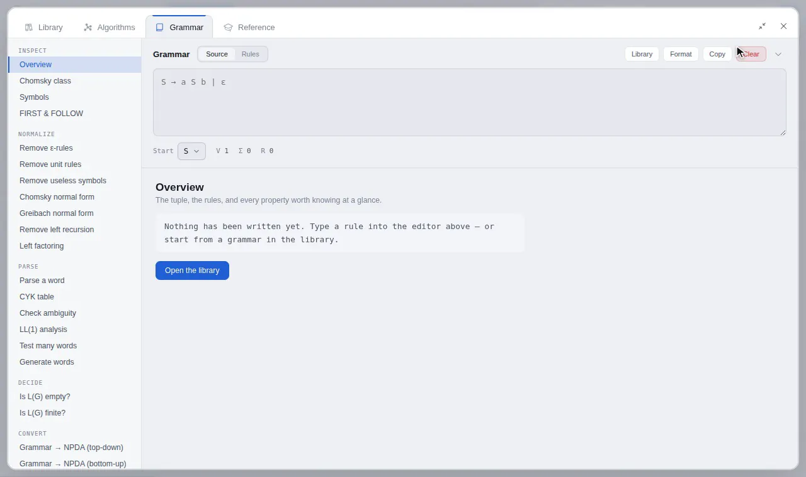
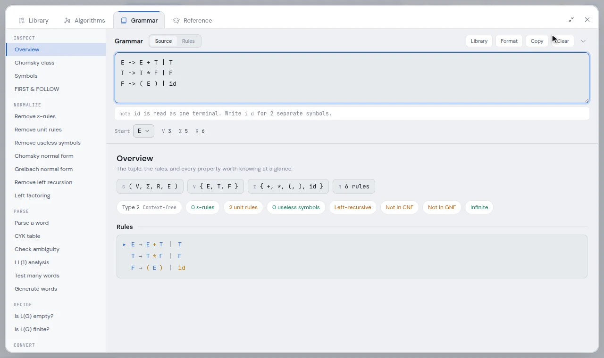
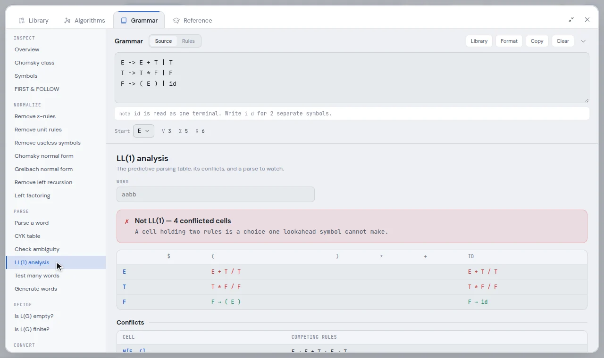
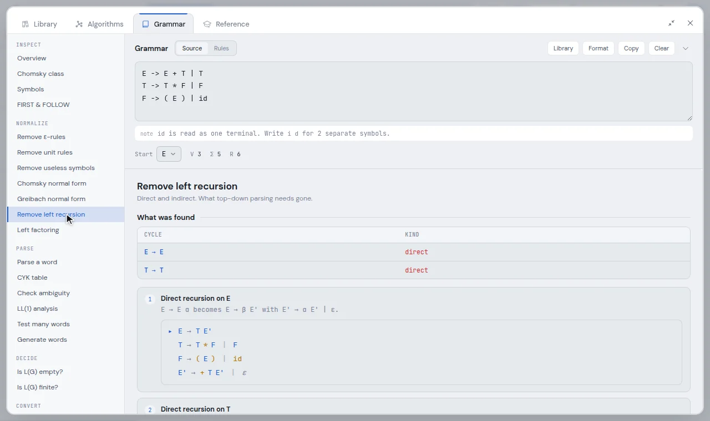

# The grammar workbench

The Grammar view is where you write a grammar once and then take it apart with 25
tools: inspect it, normalise it, parse words with it, decide things about its
language, and convert it to and from machines on the canvas.

Open it with the **Grammar** tab of the aux window, or <kbd>4</kbd> on the canvas.



<sup>The grammar is checked as you type it. CYK fills its table one span at a time on
`aabb`, then *Check ambiguity* finds two different parse trees for `ababab`, which proves
the grammar ambiguous.</sup>

- [Writing a grammar](#writing-a-grammar)
- [The tools](#the-tools)
- [Parsing: CYK and derivations](#parsing-cyk-and-derivations)
- [Transforms show their working](#transforms-show-their-working)
- [Converting to and from the canvas](#converting-to-and-from-the-canvas)

---

## Writing a grammar

The grammar sits in a card at the top of the view, and every tool reads it. Write one
rule per line, with alternatives separated by `|`:

```text
E -> E + T | T
T -> T * F | F
F -> ( E ) | id
```

- `->`, `→`, `=>` and `::=` all work as the arrow. The empty word is `ε`, `λ` or `eps`.
  A bare `|` with nothing beside it is an error, so the empty word is never written by
  accident.
- **Variables** are the symbols on left-hand sides. **Start** chooses the start symbol
  from them, and defaults to the first rule's.
- **Whitespace separates symbols.** `a S b` is three symbols. A run of letters with no
  variable in it, like `id`, is one terminal. Write `i d` if you mean two.
- `<Expr>` and `[q0,A,q1]` are always single symbols, which is how the grammars that
  *Canvas PDA → grammar* produces read back.
- **Source** shows what you typed. **Rules** shows what the parser read, symbol by
  symbol, with variables and terminals coloured. If the two differ, the line above the
  footer explains why.
- The footer counts V, Σ and R. **Library** loads one of the example grammars, and
  **Format** rewrites the source in a canonical layout.

The grammar is saved with the workspace and is on the undo stack. A run of keystrokes
is one undo step.



## The tools

| Group | Tools |
| --- | --- |
| **Inspect** | Overview · Chomsky class · Symbols · FIRST & FOLLOW |
| **Normalize** | Remove ε-rules · Remove unit rules · Remove useless symbols · Chomsky normal form · Greibach normal form · Remove left recursion · Left factoring |
| **Parse** | Parse a word · CYK table · Check ambiguity · LL(1) analysis · Test many words · Generate words |
| **Decide** | Is L(G) empty? · Is L(G) finite? |
| **Convert** | Grammar → NPDA (top-down) · Grammar → NPDA (bottom-up) · Canvas PDA → grammar · Grammar → automaton · Canvas automaton → grammar |
| **Library** | Example grammars |

- **Overview** shows the tuple, the rules, and a row of facts at a glance: the
  grammar's Chomsky type, ε-rules, unit rules, useless symbols, left recursion, whether
  it is already in CNF or GNF, and whether its language is finite.
- **Chomsky class** tests the grammar against each type in turn, including the
  non-contracting condition that separates type 1 from type 0.
- **FIRST & FOLLOW** gives both sets for every variable, which the LL(1) table is built
  from.
- **LL(1) analysis** builds the predictive parsing table and lists each conflicted cell
  with the rules that compete for it, and the usual fixes. Type a word and it traces the
  predictive parse: the stack, the remaining input and the action at each step.
- **Test many words** decides a list of words at once. **Generate words** lists the
  shortest words in the language.
- **Is L(G) finite?** answers with the cycle that makes it infinite (through symbols
  that are both reachable and generating), or, when it is finite, lists every word.



## Parsing: CYK and derivations

There are two engines, and each has its own job.

- **CYK** decides membership. It always answers, in cubic time, and works on Chomsky
  normal form. The table you scrub through is the table of the *converted* grammar, and
  the conversion is shown below it.
- **Parse trees, leftmost and rightmost derivations, and ambiguity witnesses** come from
  a search over the rules **you wrote**, so they are about your grammar and not its CNF.
  The search only runs on a word CYK has already accepted.

**Check ambiguity** looks for two structurally different parse trees of a word. Finding
two proves the grammar ambiguous. Finding one is evidence, not proof: another word may
still be ambiguous, and whether a grammar is ambiguous at all is undecidable. The tool
says which of the two you are looking at.

## Transforms show their working

Every normalisation is a worked construction. It shows one stage per textbook step,
each with the grammar that step left behind, and a note of any precondition it had to
establish first:

- **Greibach normal form** first converts to CNF, and says so.
- **Remove left recursion** removes ε-rules first, and handles indirect recursion
  (`A → B a`, `B → A b`) by ordering the variables and substituting earlier ones out.
  A variable whose every alternative is left-recursive is left alone, with the reason.
- **Left factoring** pulls out common prefixes until no two alternatives of a variable
  share one.

The tests check every transform by comparing the language before and after, word by
word up to a length, across several grammars.



## Converting to and from the canvas

| Tool | Does |
| --- | --- |
| Grammar → NPDA (top-down) | the standard construction: expand variables on the stack, match terminals |
| Grammar → NPDA (bottom-up) | shift–reduce: push terminals, reduce right-hand sides |
| Canvas PDA → grammar | the triple construction, with variables `[p,A,q]` |
| Grammar → automaton | a right- or left-linear grammar to a finite automaton |
| Canvas automaton → grammar | a finite automaton to a right-linear grammar |

A conversion to a machine shows the construction and offers **Load onto the canvas**.
A conversion from the canvas shows the grammar and offers **Apply to the editor**, which
puts it in the grammar card for every other tool to work on, or **Copy**.

For the finite-automaton constructions themselves (subset construction, minimisation,
regular expressions), see [Algorithms](algorithms.md).
