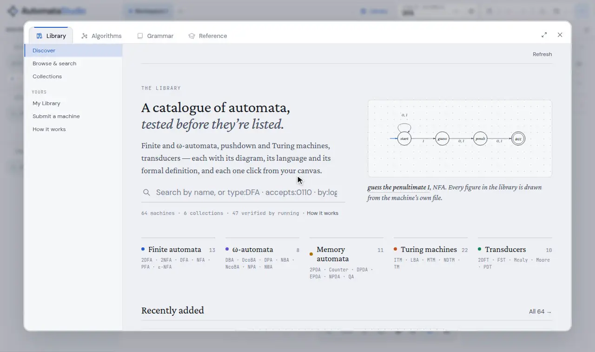
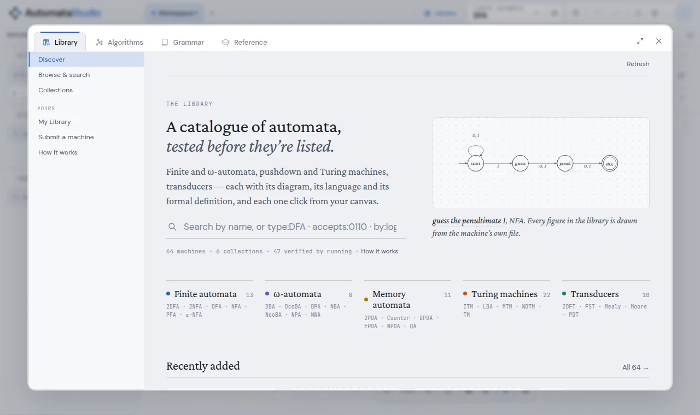
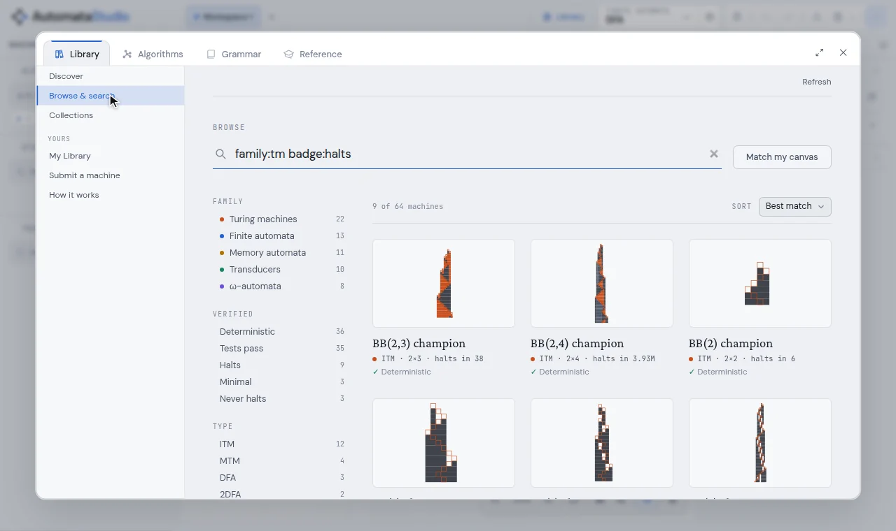
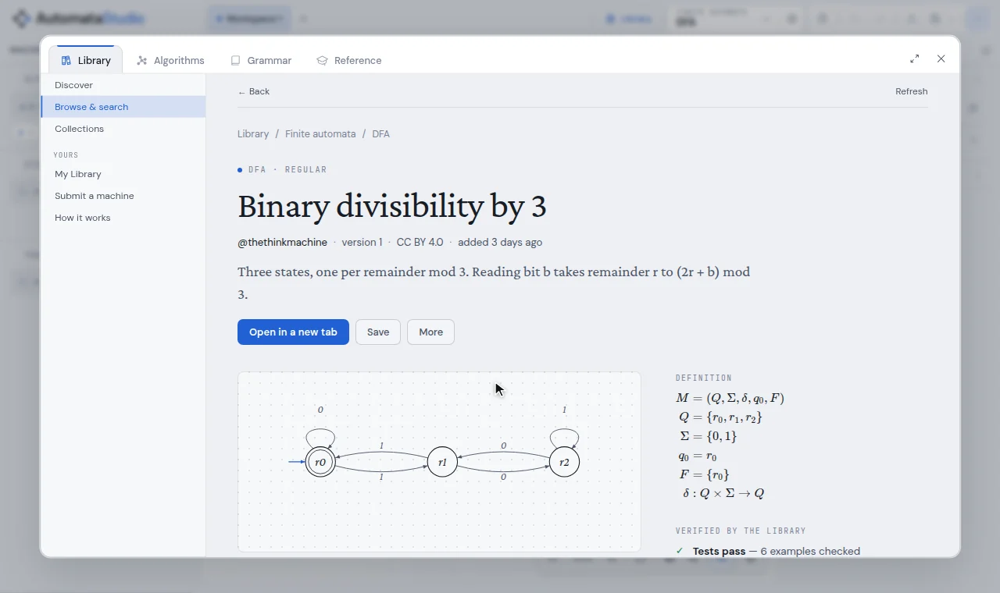
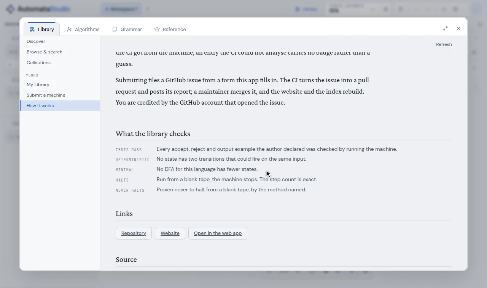

# The machine library

The library is a public, searchable catalogue of machines you can run without opening
them, learn from, open on your canvas, remix, and add to. Every badge on a listing
comes from running the machine, not from what its author claimed.

Open it with the **Library** tab of the aux window, from the header, or with
<kbd>2</kbd> on the canvas. It is also published as a website at
[thethinkmachine.github.io/automata-library](https://thethinkmachine.github.io/automata-library/).



<sup>Search for *divisibility*, open *Binary divisibility by 3*, run `1100` on it without
leaving the page (the path lights up, then *Accepted*), and *Open in a new tab* puts it
on the canvas with its test words as chips.</sup>

- [What is in it](#what-is-in-it)
- [Finding a machine](#finding-a-machine)
- [An entry page](#an-entry-page)
- [Badges](#badges)
- [My Library and offline use](#my-library-and-offline-use)
- [Links to a machine](#links-to-a-machine)
- [Submitting a machine](#submitting-a-machine)
- [Updates and remixes](#updates-and-remixes)
- [Running your own copy](#running-your-own-copy)

---

## What is in it

Machines of every family the app can build (finite automata, ω-automata, pushdown and
other memory automata, Turing machines and transducers), grouped into **collections**
the way a course or a question would group them: *Regular languages, start to finish*,
*Beyond regular*, *The ω-automata zoo*, *Machines that write*, the *Busy Beaver Hall of
Fame*, and *Three ways to never halt*.

Some entries and collections carry an **essay**: a write-up beside the machine, with
figures drawn from the machine itself.



## Finding a machine

**Browse & search** lists everything, with filters down the side by family, by what
the library verified, by machine type and by tag. The search box takes plain words and
`key:value` filters, which combine:

| Filter | Finds |
| --- | --- |
| `type:DFA` | one machine type (`NPDA`, `TM`, `NBA`, …) |
| `family:tm` | a whole family: `fa` (finite), `omega`, `mem` (memory automata), `tm`, `special` (transducers) |
| `badge:minimal` | entries with a badge: `tested`, `deterministic`, `minimal`, `halts`, `never-halts` |
| `states:<10`, `states:>=3` | by size |
| `accepts:0110`, `rejects:ab` | finite automata that accept (or reject) a word; the word is run on every candidate |
| `by:login` | one author |
| `tag:parity` | one tag |
| `level:intro` | `intro`, `intermediate` or `advanced` |

`accepts:` and `rejects:` answer by running machines, so you can search by behaviour:
`type:DFA accepts:0110 rejects:011` finds the DFAs that tell those two words apart.

**Pasting a machine code** (the one-line form from **Copy Machine Code**, or a Turing
machine in standard notation like `1RB1LB_1LA1RZ`) finds that exact machine, whatever
its states are named.

**Match my canvas** searches with the machine you have open. It finds the same machine
(any type), and for a finite automaton any entry that recognises the same language,
however it is drawn. The result says which of the two it found.



## An entry page

An entry shows the machine's diagram, the language it accepts (as a strip of accepted
and rejected words), its formal definition, its badges, the author's test words, its
licence and its **machine code**. You do not need to open it to try it:

- **Try it** runs a word on the machine in place and replays the run on the diagram.
- **The author's examples** are the test words from the machine's card. Click one to run it.
- **Open in a new tab** puts the machine on the canvas in a tab of its own, so whatever
  you were working on stays where it was.
- **Save** keeps a copy in My Library.
- **More** downloads the `.automaton` file or copies a link to the entry.



## Badges

A badge is something the library's CI found by running the machine with this app's own
engine. Nothing on a listing is taken from the author except their words.

| Badge | Means |
| --- | --- |
| **Tests pass** | Every accept, reject and output example the author declared was checked by running the machine. A failing example blocks the entry from being published. |
| **Deterministic** | No state has two transitions that could fire on the same input, by the editor's own rule. An NFA earns it only when it never actually branches. |
| **Minimal** | No DFA for this language has fewer states. |
| **Halts** | Run from a blank tape, the machine stops. The step count is exact. |
| **Never halts** | Proven never to halt from a blank tape, by the method named (see [halting proofs](cli.md#turing-machines-does-it-halt)). |

The library lists each machine only once. Two submissions that are the same machine up
to state names, layout and symbol order count as one, and the later one is refused.
Two *different* machines that recognise the same language are both welcome.



## My Library and offline use

**Save** on an entry keeps a copy in your browser. **My Library** lists those copies,
they open without a network, and when a newer version of one is published, My Library
says so.

A machine opened from the library remembers where it came from, even after you edit it
and save it to a file. That is how its card can say "update available", and how
submitting it later knows whether it is an update or a remix.

## Links to a machine

| Link | Does |
| --- | --- |
| `…/AutomataStudio/#lib=<id>` | opens the entry's machine on the canvas |
| `…/AutomataStudio/#library=<id>` | shows the entry's page |
| `…/AutomataStudio/#collection=<id>` | shows a collection |
| `…/AutomataStudio/#library` | opens the library |
| `automata-studio://…` | the same, in the desktop app |

**More → Copy link** on an entry copies the second kind, and **Copy link** on a collection the third.

## Submitting a machine

**Submit a machine** sends the machine on your canvas to the library. There is no
server and nothing to sign in to inside the app. The form opens a GitHub issue, already
filled in, on the library's repository. You need a GitHub account, and you are credited
by it.

1. Build the machine, give it a title and a description on its info card, and add test
   words with their expected verdicts. Those become the **Tests pass** badge.
2. Open **Submit a machine**. It runs the same checks CI will run and shows the badges
   the machine will earn, and anything that would stop it being published.
3. Choose a licence and tags, optionally write an essay, and press **Submit on GitHub**.
4. The library's CI turns the issue into a pull request and posts its report there. A
   maintainer reviews and merges it, and the index and website rebuild.

A machine already in the library is refused as a new entry. The form tells you to send
an update if it is yours, or a remix if it is someone else's.

## Updates and remixes

A machine you opened from the library and then changed is submitted as one of two
things, and your GitHub account decides which:

- **An update**, if you are the entry's author. It replaces the entry in place, and
  links to it keep working.
- **A remix**, if you are not. It becomes a new entry, credited to you, that links back
  to the one it came from.

## Running your own copy

The library is an ordinary repository, so you can build and serve it locally, for
example to try a change before submitting it:

```sh
npm run library:dev -- --library ../automata-library   # serve a checkout locally
npm run library:build -- --library ../automata-library # build its index and website to _site/
npm run library:init -- ../my-library                  # scaffold and seed a new one
```

`library:dev` prints a link that points the app at your local copy, and it emulates the
GitHub submission form too. **How it works → Source** in the Library view switches back.
