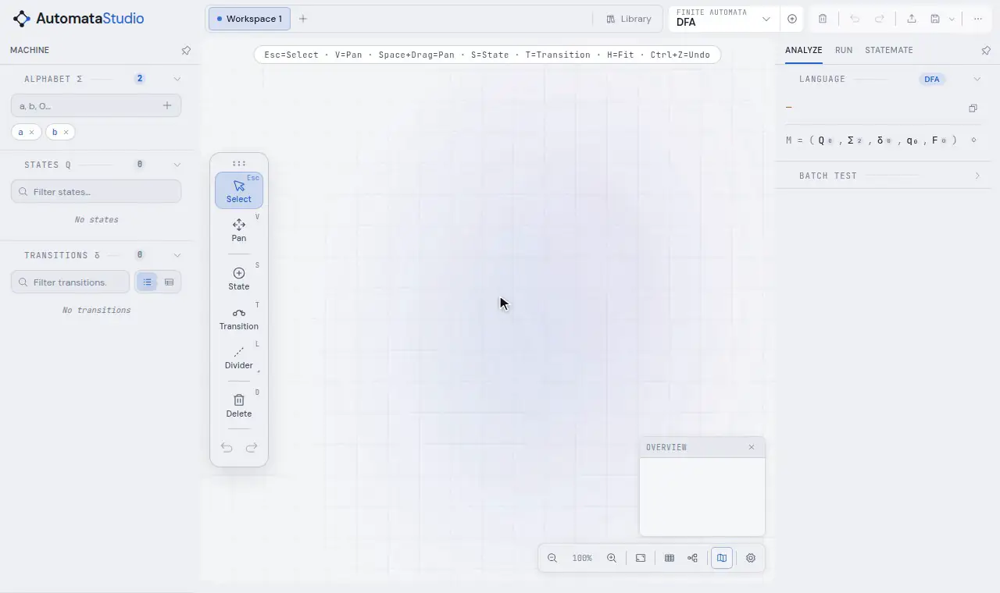
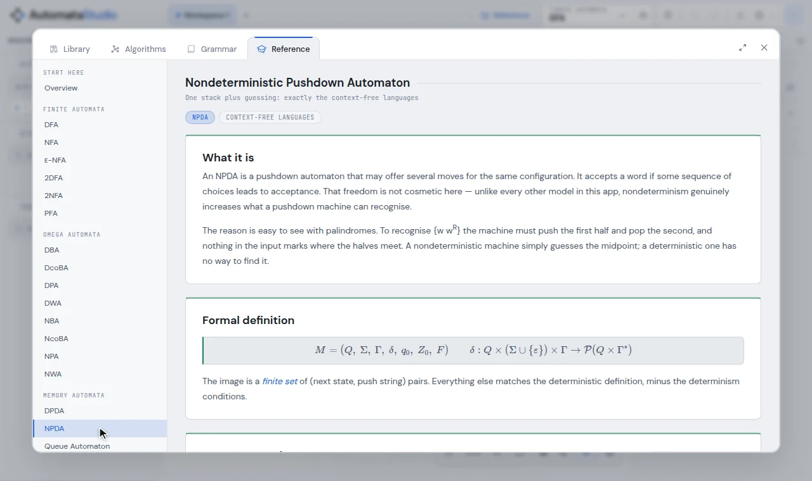
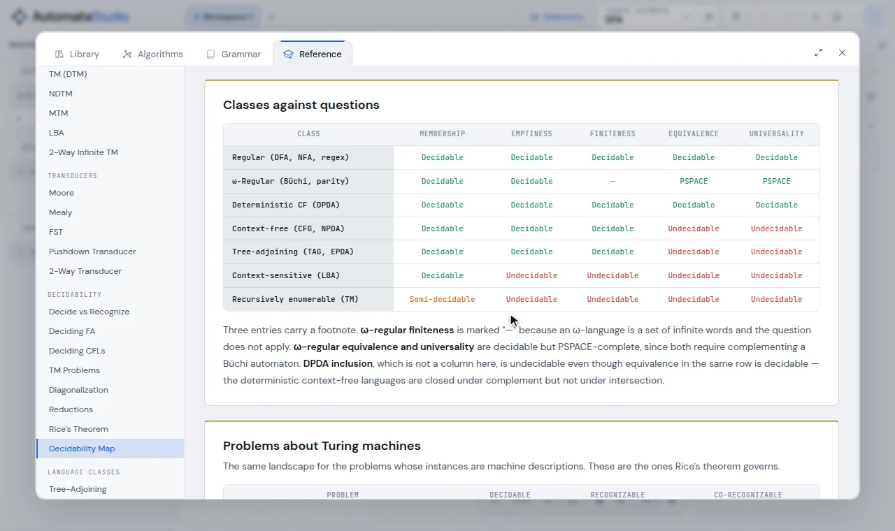

# The reference

The Reference view is a built-in textbook: one page for every machine the app can
build, plus sections on decidability and language classes. It is part of the app, so
it works offline, and it always matches what the editor does.

Open it with the **Reference** tab of the aux window, or <kbd>5</kbd> on the canvas.
It opens on the page for the machine type on your canvas.

- [Machine pages](#machine-pages)
- [Decidability](#decidability)
- [Language classes](#language-classes)

---

## Machine pages

The rail lists the machines in the same groups as the model picker: finite automata,
ω-automata, memory automata, Turing machines and transducers. Each page covers, in
order:

1. **What it is**, in plain words.
2. **Formal definition**: the tuple, and what each part is.
3. **How a run works**: configurations and the step relation.
4. **Acceptance**, including the ω-conditions (Büchi, co-Büchi, parity, weak) on the
   ω-automata pages.
5. **What it can and cannot express**, with the languages that separate it from its
   neighbours.
6. Topics particular to the model, such as minimality and the Myhill–Nerode theorem on
   the DFA page, or why nondeterminism adds power to a pushdown automaton.
7. **In this editor**: how the app draws and runs it.

The formal definition on each page is the same tuple the inspector prints for the
machine on your canvas, and a test checks that the two agree. A machine type added to
the app cannot go undocumented either: a test fails until it has a page.

## Decidability

| Page | Covers |
| --- | --- |
| Decide vs Recognize | decidable and recognisable languages, and deciders versus recognisers |
| Deciding FA | membership, emptiness, finiteness, equivalence and universality for finite automata |
| Deciding CFLs | the same questions for context-free languages, and where they stop being decidable |
| TM Problems | the halting problem and its relatives |
| Diagonalization | why some languages are not even recognisable |
| Reductions | proving undecidability by reduction |
| Rice's Theorem | every non-trivial semantic property of a TM's language is undecidable |
| Decidability Map | every class against every standard question, in one table |

The **Decidability Map** reads down a column: decidable, semi-decidable or
undecidable, for regular, ω-regular, deterministic context-free, context-free,
tree-adjoining, context-sensitive and recursively enumerable languages. A second table
does the same for questions about Turing machines.

## Language classes

**Tree-Adjoining** explains tree-adjoining grammars, the grammar side of the embedded
pushdown automaton (EPDA). The app has no TAG editor, so this page is where the class is
explained.

The EPDA's page links here, and links between pages stay inside the view.
