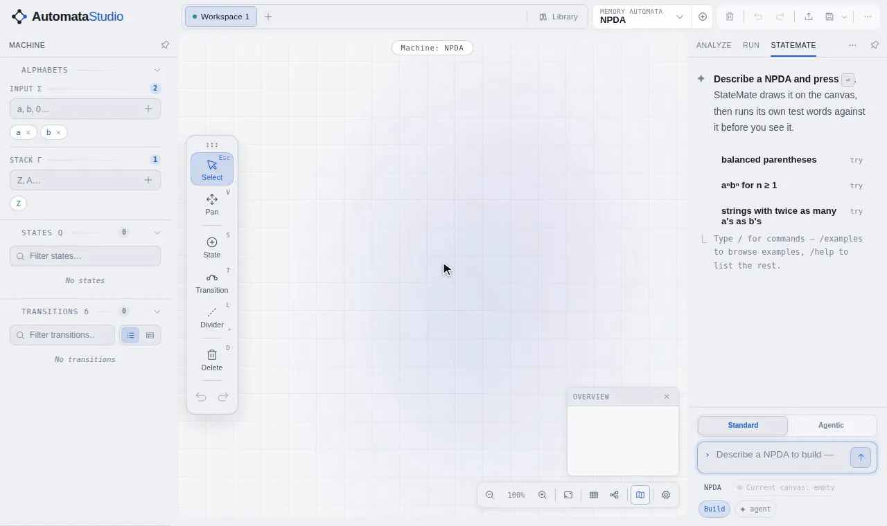
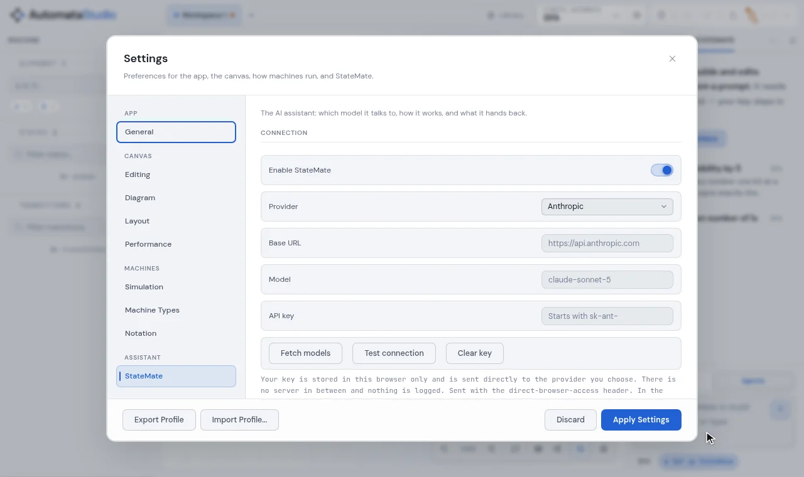
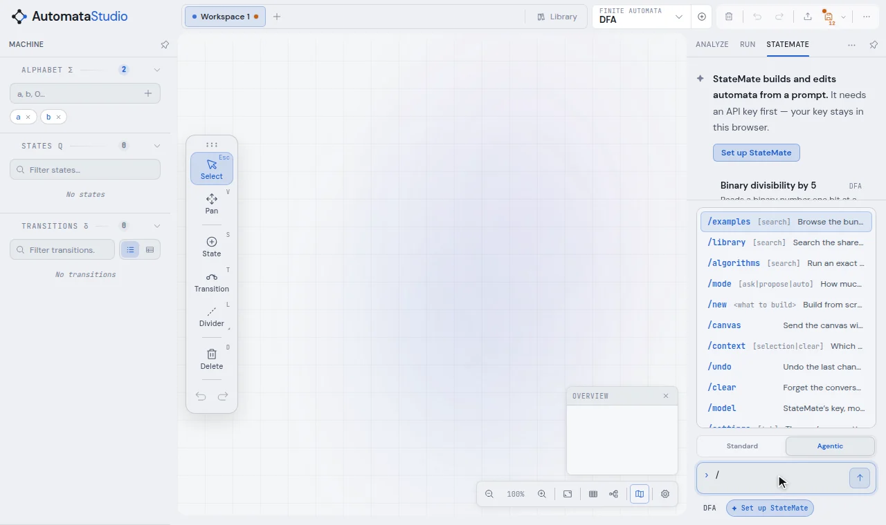

# StateMate

StateMate is the app's optional AI assistant. It builds and edits machines from a
sentence, answers questions about the machine on the canvas, and explains theory. It
never puts an unchecked machine in front of you: every machine it proposes is run on
the app's real simulator against its own test words first.

It lives in the **StateMate** tab of the right panel. It is off until you turn it on and
choose a provider.



<sup>One prompt, *a pushdown automaton that accepts balanced strings of ( ) and [ ]*. The
proposal arrives as a diff with its test words already run (5/5 checks). **Apply** draws
it, and `([])` is accepted.</sup>

- [Setting it up](#setting-it-up)
- [Asking for a machine](#asking-for-a-machine)
- [What happens to an answer](#what-happens-to-an-answer)
- [Chat, Build and Auto](#chat-build-and-auto)
- [Standard and Agentic](#standard-and-agentic)
- [Commands](#commands)
- [Privacy](#privacy)

---

## Setting it up

Open **Settings → StateMate** (or type `/model` in the console), turn on **Enable
StateMate**, and choose a provider:

| Provider | Notes |
| --- | --- |
| Anthropic | the default |
| OpenAI | |
| Mistral AI | |
| Google AI Studio | |
| Cohere | |
| OpenRouter.ai | many models behind one key |
| Local Server (OpenAI-compatible) | llama.cpp, Ollama, LM Studio, vLLM and the like, at `http://localhost:8080/v1` by default. The server must allow the page's origin. |
| Claude Code (desktop app) | uses your own Claude Code sign-in. No key, and desktop only. |

Paste your API key, pick a model (**Fetch models** lists what the key can use), and
press **Test connection**.

In the browser, requests go straight from the page to the provider, which some
providers' CORS policies limit. The settings tab says when that applies. The desktop
app sends requests from its own process and is not affected.



## Asking for a machine

Type what you want and press <kbd>Enter</kbd>:

- *a DFA for binary numbers divisible by 3*
- *make it reject the empty word*
- *a Turing machine that doubles a unary number*
- *why does my machine reject `abba`?*
- *what is the difference between a DPDA and an NPDA?*

The canvas's machine type is the default, but StateMate switches type when the request
needs it (a language no DFA can recognise, say) and tells you it did. With the canvas
attached, it edits the machine you have rather than starting over, and keeps the
positions and names of every state it did not need to change. Select part of the
diagram and use `/context` to point it at just that part.

A request that could mean very different machines gets a question back. A small
ambiguity gets a machine, with the assumption stated.

## What happens to an answer

```
your prompt → the model → parse → compile → lint → verify → apply
                  ↑                                   │
                  └──── repair: "these tests failed" ─┘
```

1. **Parse.** The answer is either a machine or a reply. A reply is shown as text and
   never touches the canvas.
2. **Compile and lint.** The machine is built off-canvas and checked against the rules
   of its type, for example that a DFA really is deterministic.
3. **Verify.** The model's own test words, each with the verdict it predicted, are run
   on the real simulator. If any disagree, the model is sent the failing words with a
   trace of where each run went wrong, and asked to repair the machine.
4. **Apply.** Only now is the canvas written, in one step that one
   <kbd>Ctrl</kbd>+<kbd>Z</kbd> undoes.

A failed run (a rejected key, an unreadable answer, a machine that fails its checks)
leaves your canvas exactly as it was. While the model is writing, the draft machine is
drawn dashed over the canvas, so you can see it take shape.

## Chat, Build and Auto

How much StateMate may change without asking is your choice, never the model's.
<kbd>Shift</kbd>+<kbd>Tab</kbd> in the console cycles through the modes, or use `/mode`.

| Mode | Does |
| --- | --- |
| **Chat** | Read-only. StateMate answers and explains, and the canvas is never touched. |
| **Build** (default) | Builds and checks a machine, then shows you the diff (states, transitions and alphabet changes, line by line) with **Apply**, **Discard** and **Ask again**. |
| **Auto** | Draws straight onto the canvas once the machine passes its checks. An edit that would remove more than half your states is held as a proposal instead. |

## Standard and Agentic

The two buttons above the composer choose how StateMate works:

- **Standard.** One model response builds the machine or answers. Fast and cheap.
- **Agentic.** StateMate works over several steps on a private copy of the machine,
  using tools: it can inspect the canvas, add and change states and transitions,
  simulate and trace words, lint, minimise a DFA, run the subset construction, search
  the library, and ask you a question. It stops when it calls the result finished. It
  is better for larger or fiddlier machines, and costs more requests.

## Commands

Type `/` in the console for the list. <kbd>Enter</kbd> on a command with arguments
completes it, and lists what it can take.

| Command | Does |
| --- | --- |
| `/examples [search]` | browse the bundled example machines |
| `/library [search]` | search the [machine library](library.md) |
| `/algorithms [search]` | run an exact construction instead, with no model call |
| `/mode ask\|propose\|auto` | set the write mode (Chat, Build or Auto) |
| `/new <what to build>` | build from scratch, ignoring the canvas |
| `/canvas` | send the canvas with your prompt, or stop sending it |
| `/context [selection\|clear]` | say which part of the diagram the next prompt is about |
| `/undo` | undo the last change on the canvas |
| `/clear` | forget the conversation and start over |
| `/model` | StateMate's key, model and behaviour |
| `/settings [tab]` | the app's own settings |
| `/help` | everything you can type |

When a request names a construction the app can do exactly, such as *minimise this
DFA*, a note above the composer offers the exact algorithm instead.



## Privacy

- **Your key stays in your browser** (or the desktop app's storage), under StateMate's
  own storage key. It is never written into a saved file, a share link, a PNG with an
  embedded workspace, an autosave or a workspace tab, and a test checks this.
- Requests go **directly** from your machine to the provider you chose. There is no
  AutomataStudio server in between, and nothing is logged.
- What is sent is your prompt, the recent conversation, and, while `/canvas` is on, the
  machine on the canvas.

For testing prompts without a provider, the repository has an
[agent bridge](../tools/agent-bridge/statemate-bridge.mjs) that lets a Claude Code
session answer StateMate's requests by hand.
